# 智慧养老数据库系统 - 需求规格说明书

## 文档信息

| 项目 | 内容 |
|------|------|
| 文档版本 | v1.2 |
| 编制日期 | 2026-02-07 |
| 项目名称 | 智慧养老数据库系统 |
| 文档状态 | 修改稿 |

---

## 目录

- [1. 背景（前因后果）](#1-背景前因后果)
- [2. 项目愿景（目标、解决的问题）](#2-项目愿景目标解决的问题)
- [3. 涉及到的用户角色](#3-涉及到的用户角色)
- [4. 主要的业务流程](#4-主要的业务流程)
- [5. 数据](#5-数据)
- [6. 外部接口](#6-外部接口)
- [7. 功能](#7-功能)
- [8. 性能](#8-性能)
- [9. 开发（语言、框架）](#9-开发语言框架)
- [10. 希望的输出成果](#10-希望的输出成果)
- [附录](#附录)

---

## 1. 背景（前因后果）

### 1.1 社会背景

随着我国人口老龄化程度不断加深，城镇及乡镇地区老年人口数量持续增长。据国家统计局数据显示，我国60岁及以上人口占比已超过18%，且呈现持续上升趋势。这一人口结构变化对社会养老服务体系建设提出了严峻挑战。

### 1.2 现状问题

当前城镇/乡镇地区老年人养老情况的管理工作面临以下突出问题：

#### 1.2.1 数据管理层面
- **统计方式落后**：传统统计方式以纸质记录、分散Excel表格为主，缺乏系统化管理
- **数据整合效率低**：不同部门、不同时期的数据难以快速整合分析
- **数据安全风险高**：纸质文件易丢失、损坏，缺乏备份机制
- **汇总展示不直观**：数据统计耗时耗力，难以快速生成可视化报告

#### 1.2.2 隐私保护层面
- **公开性与隐私性难以平衡**：汇总统计数据需要向社会公开，但个人具体敏感信息需要严格保护
- **权限管理缺失**：缺乏完善的用户权限体系，无法精确控制数据访问范围

#### 1.2.3 民意收集层面
- **诉求收集渠道缺失**：老年人的养老诉求、生活困难等问题缺乏统一的收集渠道
- **信息反馈滞后**：政府/社区难以及时、精准掌握辖区内养老需求
- **政策制定缺乏数据支撑**：养老服务优化、政策调整缺乏可靠的数据依据

### 1.3 建设契机

为响应国家"智慧养老"政策号召，提升基层养老治理能力，亟需建设一套数字化、智能化的养老数据管理系统。通过信息化手段整合养老数据、畅通民意渠道、支撑科学决策，切实提升养老服务的精准性和有效性。

---

## 2. 项目愿景（目标、解决的问题）

### 2.1 核心目标

搭建一套**轻量化、易操作、安全可控**的"智慧养老数据库"Web系统，实现城镇/乡镇老年人养老数据的统一管理、民意调查的高效收集、养老问题的定向反馈，为政府决策和社区服务提供数据支撑。

### 2.2 解决的问题

#### 2.2.1 数据管理问题
| 问题 | 解决方案 |
|------|----------|
| 养老数据分散存储，难以统一管理 | 建立集中式数据库，实现数据统一存储 |
| 统计效率低，汇总耗时费力 | 自动生成汇总统计，支持多维度查询 |
| 数据展示不直观，难以快速理解 | 提供可视化图表展示，支持数据导出 |
| 纸质记录易丢失、损坏 | 数据库持久化存储，支持定期备份 |

#### 2.2.2 隐私保护问题
| 问题 | 解决方案 |
|------|----------|
| 个人隐私数据与公开数据难以区分 | 实现数据分级管理，汇总数据公开、个人数据仅管理员可见 |
| 缺乏有效的访问控制机制 | 建立角色权限体系，精确控制数据访问范围 |
| 敏感信息泄露风险 | 身份证号、联系方式等敏感字段仅管理员可查看 |

#### 2.2.3 民意收集问题
| 问题 | 解决方案 |
|------|----------|
| 缺乏统一的民意收集渠道 | 提供在线民意调查功能，随时收集反馈 |
| 老年人诉求难以传达 | 建立问题收集模块，支持文字描述反馈 |
| 需求响应不及时 | 管理员可实时查看、分类处理问题 |

#### 2.2.4 决策支撑问题
| 问题 | 解决方案 |
|------|----------|
| 政策制定缺乏数据依据 | 提供多维度统计分析，为决策提供支撑 |
| 养老服务优化方向不明确 | 基于民意调查结果，精准识别服务需求 |
| 资源分配缺乏量化标准 | 通过数据分析，优化养老资源配置 |

---

## 3. 涉及到的用户角色

### 3.1 角色定义

系统采用基于角色的访问控制（RBAC）模型，定义两种用户角色：

#### 图3-1 用户角色分类

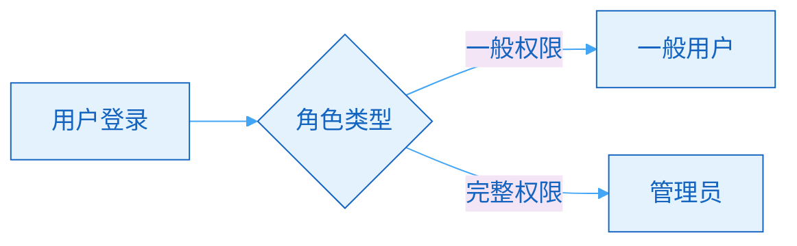
```mermaid
%%{init: {'theme':'base', 'themeVariables': {'primaryColor':'#e3f2fd','primaryTextColor':'#1565c0','primaryBorderColor':'#1565c0','lineColor':'#42a5f5','secondaryColor':'#f3e5f5','tertiaryColor':'#e8f5e9','fontSize':'18px','fontFamily':'Microsoft YaHei'}}}%%
graph LR
    A[用户登录] --> B{角色类型}
    B -->|一般权限| C[一般用户]
    B -->|完整权限| D[管理员]
```

#### 图3-2 一般用户权限

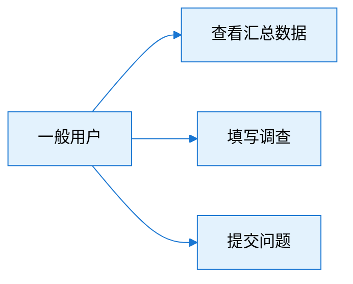
```mermaid
%%{init: {'theme':'base', 'themeVariables': {'primaryColor':'#e3f2fd','primaryTextColor':'#000','primaryBorderColor':'#1976d2','lineColor':'#1976d2','fontSize':'16px','fontFamily':'Microsoft YaHei'}}}%%
graph LR
    User[一般用户] --> P1[查看汇总数据]
    User --> P2[填写调查]
    User --> P3[提交问题]
```

#### 图3-3 管理员权限

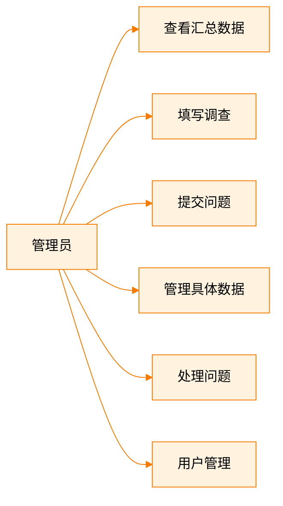
```mermaid
%%{init: {'theme':'base', 'themeVariables': {'primaryColor':'#fff3e0','primaryTextColor':'#000','primaryBorderColor':'#f57c00','lineColor':'#f57c00','fontSize':'16px','fontFamily':'Microsoft YaHei'}}}%%
graph LR
    Admin[管理员] --> P1[查看汇总数据]
    Admin --> P2[填写调查]
    Admin --> P3[提交问题]
    Admin --> P4[管理具体数据]
    Admin --> P5[处理问题]
    Admin --> P6[用户管理]
```

### 3.2 一般用户

#### 3.2.1 角色定位
一般用户指需要查看养老统计数据、参与民意调查、提交养老问题的普通用户，包括社区工作者、调查员、老年人家属等。

#### 3.2.2 核心权限

| 权限类别 | 具体权限 | 权限说明 |
|----------|----------|----------|
| **账户管理** | 注册账号 | 使用用户名、密码、手机号注册系统账户 |
| | 登录系统 | 输入用户名、密码登录系统 |
| | 修改密码 | 可修改个人登录密码 |
| | 修改用户名 | 可修改自己账号显示的用户名 |
| | 注销账号 | 可注销自己的账号（需二次确认，不可恢复） |
| **数据查看** | 查看养老数据汇总 | 可查看各地区养老数据的统计汇总结果（如养老金均值、疾病占比等） |
| | 筛选查看 | 支持按地区、年龄段等条件筛选查看汇总数据 |
| | 导出汇总数据 | 可将汇总统计结果导出为Excel/CSV格式 |
| **民意调查** | 填写民意调查 | 可填写并提交民意调查表单 |
| | 查看调查结果 | 可查看民意调查的汇总统计结果 |
| **问题收集** | 提交问题 | 可填写并提交养老问题、困难或建议 |
| | 查看个人提交记录 | 可查看自己提交的问题及处理状态 |
| **页面导航** | 页面跳转 | 可在系统各页面之间正常跳转 |

#### 3.2.3 权限限制
- **禁止**查看具体个人的养老数据（姓名、身份证号、联系方式等）
- **禁止**查看其他用户提交的民意调查原始数据
- **禁止**查看其他用户提交的问题收集内容
- **禁止**进行数据的录入、修改、删除操作
- **禁止**访问管理员专属页面

### 3.3 管理员

#### 3.3.1 角色定位
管理员指拥有系统完整管理权限的用户，负责养老数据的录入维护、民意调查的统计分析、问题收集的处理反馈等工作。

#### 3.3.2 核心权限

| 权限类别 | 具体权限 | 权限说明 |
|----------|----------|----------|
| **一般用户权限** | 继承一般用户所有权限 | 管理员拥有一般用户的所有权限 |
| **养老数据管理** | 查看具体数据 | 可查看每个老年人的详细养老数据 |
| | 录入具体数据 | 可录入新的老年人养老数据 |
| | 修改具体数据 | 可修改已录入的养老数据 |
| | 删除具体数据 | 可删除错误或过期的养老数据 |
| | 批量导入数据 | 支持通过Excel批量导入养老数据 |
| | 数据导出 | 可导出养老数据为Excel/CSV格式 |
| **民意调查管理** | 查看原始数据 | 可查看所有用户提交的民意调查原始数据 |
| | 按条件筛选 | 支持按提交时间、问题类型等条件筛选查看 |
| | 数据导出 | 可导出民意调查原始数据 |
| **问题收集管理** | 查看所有问题 | 可查看所有用户提交的问题收集内容 |
| | 更新处理状态 | 可将问题状态更新为"已查看"、"已解决"等 |
| | 添加处理备注 | 可对问题的处理情况添加备注说明 |
| | 问题分类统计 | 可按问题类型进行统计分析 |
| **用户账号管理** | 查看用户列表 | 可查看系统所有注册用户 |
| | 查看用户状态 | 可查看所有用户的在线状态（在线/离线/注销） |
| | 修改用户角色 | 可将一般用户提升为管理员或降级为一般用户 |
| | 重置用户密码 | 可帮助用户重置忘记的密码 |
| | 禁用/启用账号 | 可禁用违规账号或重新启用 |
| | 注销用户账号 | 可强制注销一般用户的账号（不可恢复） |
| **账户管理** | 修改自己的用户名 | 可修改自己账号显示的用户名 |
| | 注销自己的账号 | 可注销自己的账号（需二次确认，不可恢复） |

#### 3.3.3 权限限制
- 所有操作需在登录状态下进行
- 敏感操作（如删除数据）建议增加二次确认
- 管理员操作应有操作日志记录（可选功能）

### 3.4 角色权限对照表

| 功能模块 | 一般用户 | 管理员 |
|----------|----------|--------|
| 用户注册/登录 | ✓ | ✓ |
| 查看养老数据汇总 | ✓ | ✓ |
| 填写民意调查 | ✓ | ✓ |
| 查看调查结果汇总 | ✓ | ✓ |
| 提交问题收集 | ✓ | ✓ |
| 查看个人提交记录 | ✓ | ✓ |
| 查看具体养老数据 | ✗ | ✓ |
| 录入/修改/删除养老数据 | ✗ | ✓ |
| 查看民意调查原始数据 | ✗ | ✓ |
| 查看所有问题收集 | ✗ | ✓ |
| 处理问题收集 | ✗ | ✓ |
| 用户账号管理 | ✗ | ✓ |
| 批量导入/导出数据 | ✗ | ✓ |

---

## 4. 主要的业务流程

### 4.1 业务流程概述

系统包含四大核心业务流程：
1. **养老数据管理流程**：管理员录入维护养老数据，系统自动生成汇总统计
2. **民意调查流程**：用户填写调查问卷，系统汇总统计调查结果
3. **问题收集流程**：用户提交问题建议，管理员查看处理反馈
4. **页面跳转流程**：用户登录后在各功能模块间导航

### 4.2 流程1：养老数据管理流程

#### 4.2.1 流程图

**图4-1 养老数据管理主流程**

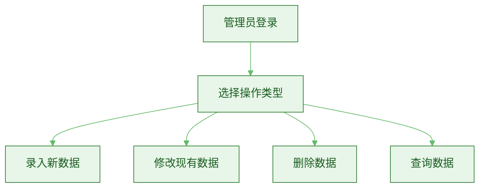
```mermaid
%%{init: {'theme':'base', 'themeVariables': {'primaryColor':'#e8f5e9','primaryTextColor':'#1b5e20','primaryBorderColor':'#2e7d32','lineColor':'#66bb6a','fontSize':'16px','fontFamily':'Microsoft YaHei'}}}%%
flowchart TD
    A[管理员登录] --> B[选择操作类型]
    B --> C1[录入新数据]
    B --> C2[修改现有数据]
    B --> C3[删除数据]
    B --> C4[查询数据]
```

**图4-2 数据录入与修改流程**

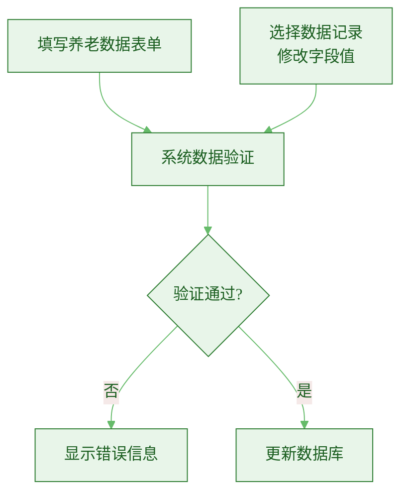
```mermaid
%%{init: {'theme':'base', 'themeVariables': {'primaryColor':'#e8f5e9','primaryTextColor':'#1b5e20','primaryBorderColor':'#2e7d32','lineColor':'#66bb6a','fontSize':'16px','fontFamily':'Microsoft YaHei'}}}%%
flowchart TD
    D[填写养老数据表单] --> H[系统数据验证]
    E[选择数据记录<br/>修改字段值] --> H
    H --> I{验证通过?}
    I -->|否| J[显示错误信息]
    I -->|是| K[更新数据库]
```

**图4-3 数据删除与查询流程**

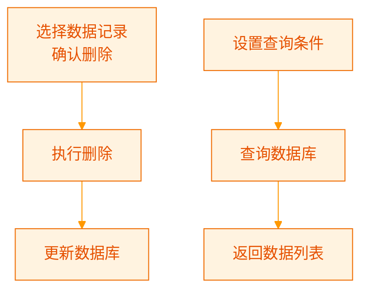
```mermaid
%%{init: {'theme':'base', 'themeVariables': {'primaryColor':'#fff3e0','primaryTextColor':'#e65100','primaryBorderColor':'#ef6c00','lineColor':'#ff9800','fontSize':'16px','fontFamily':'Microsoft YaHei'}}}%%
flowchart TD
    F[选择数据记录<br/>确认删除] --> L[执行删除]
    G[设置查询条件] --> M[查询数据库]
    L --> N[更新数据库]
    M --> O[返回数据列表]
```

**图4-4 数据更新与用户访问**

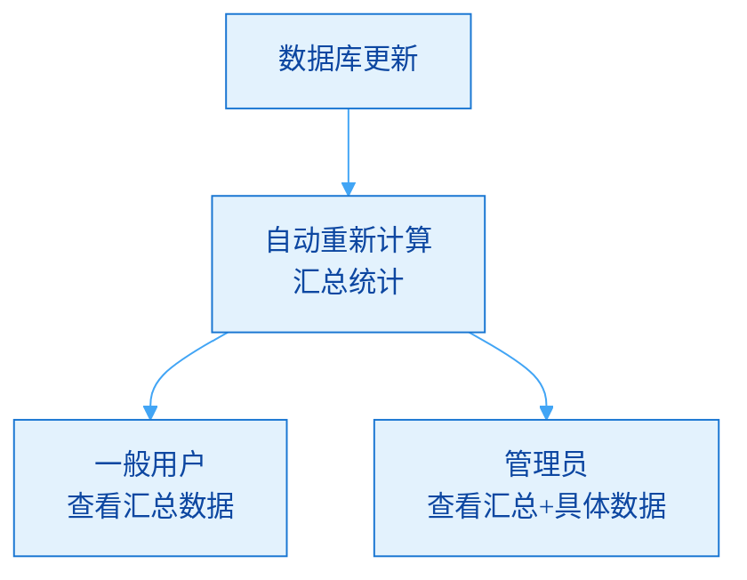
```mermaid
%%{init: {'theme':'base', 'themeVariables': {'primaryColor':'#e3f2fd','primaryTextColor':'#0d47a1','primaryBorderColor':'#1976d2','lineColor':'#42a5f5','fontSize':'16px','fontFamily':'Microsoft YaHei'}}}%%
flowchart TD
    K[数据库更新] --> Q[自动重新计算<br/>汇总统计]
    Q --> R[一般用户<br/>查看汇总数据]
    Q --> S[管理员<br/>查看汇总+具体数据]
```

#### 4.2.2 详细流程说明

| 步骤 | 操作说明 | 参与角色 | 输入 | 输出 |
|------|----------|----------|------|------|
| 1 | 管理员输入用户名、密码登录系统 | 管理员 | 用户名、密码 | 登录成功，进入管理页面 |
| 2 | 管理员选择要执行的操作类型 | 管理员 | 操作选择（录入/修改/删除/查看） | 进入对应操作页面 |
| 3A | 若选择"录入"，填写养老数据表单 | 管理员 | 姓名、身份证号、年龄等完整信息 | 数据录入提示 |
| 3B | 若选择"修改"，选择要修改的数据记录 | 管理员 | 数据记录ID、修改后的字段值 | 数据更新提示 |
| 3C | 若选择"删除"，选择要删除的数据记录 | 管理员 | 数据记录ID | 删除确认提示 |
| 3D | 若选择"查看"，设置查询条件 | 管理员 | 查询条件（姓名、地区等） | 数据列表展示 |
| 4 | 系统验证数据合法性 | 系统 | 数据内容 | 验证结果（通过/失败） |
| 5 | 系统更新数据库 | 系统 | 合法数据 | 数据库更新结果 |
| 6 | 系统自动重新计算汇总统计 | 系统 | 更新后的数据库 | 最新的汇总统计数据 |
| 7 | 一般用户登录查看汇总统计 | 一般用户 | 登录凭证 | 汇总统计展示 |
| 8 | 管理员查看汇总统计和具体数据 | 管理员 | 登录凭证 | 汇总统计+具体数据展示 |

#### 4.2.3 异常处理

| 异常情况 | 处理方式 |
|----------|----------|
| 登录密码错误 | 提示用户名或密码错误，允许重新输入 |
| 身份证号重复 | 提示该身份证号已存在，拒绝录入 |
| 必填字段为空 | 提示填写完整信息后再提交 |
| 数据库连接失败 | 提示系统维护中，记录错误日志 |
| 删除操作确认 | 弹出二次确认对话框，防止误删除 |

### 4.3 流程2：民意调查流程

#### 4.3.1 流程图

**图4-5 民意调查填写流程**

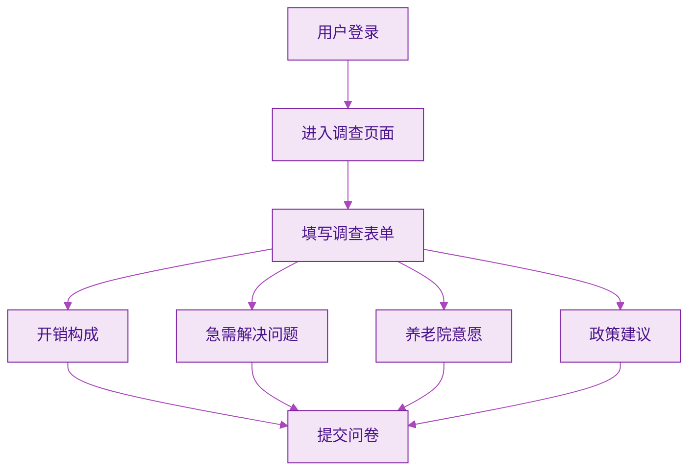
```mermaid
%%{init: {'theme':'base', 'themeVariables': {'primaryColor':'#f3e5f5','primaryTextColor':'#4a148c','primaryBorderColor':'#7b1fa2','lineColor':'#ab47bc','fontSize':'16px','fontFamily':'Microsoft YaHei'}}}%%
flowchart TD
    A[用户登录] --> B[进入调查页面]
    B --> C[填写调查表单]
    C --> D[开销构成]
    C --> E[急需解决问题]
    C --> F[养老院意愿]
    C --> G[政策建议]
    D --> H[提交问卷]
    E --> H
    F --> H
    G --> H
```

**图4-6 调查数据处理流程**

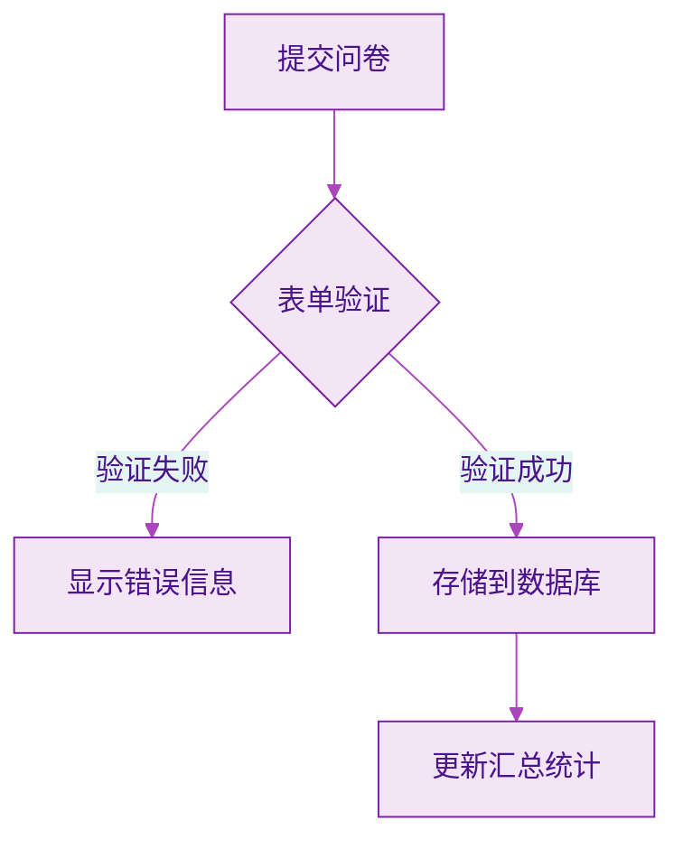
```mermaid
%%{init: {'theme':'base', 'themeVariables': {'primaryColor':'#f3e5f5','primaryTextColor':'#4a148c','primaryBorderColor':'#7b1fa2','lineColor':'#ab47bc','fontSize':'16px','fontFamily':'Microsoft YaHei'}}}%%
flowchart TD
    H[提交问卷] --> I{表单验证}
    I -->|验证失败| J[显示错误信息]
    I -->|验证成功| K[存储到数据库]
    K --> L[更新汇总统计]
```

**图4-7 调查结果查看流程**

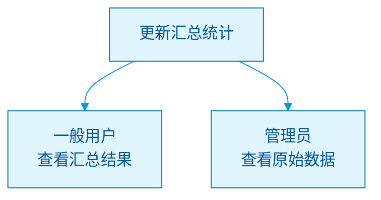
```mermaid
%%{init: {'theme':'base', 'themeVariables': {'primaryColor':'#e1f5fe','primaryTextColor':'#01579b','primaryBorderColor':'#0277bd','lineColor':'#039be5','fontSize':'16px','fontFamily':'Microsoft YaHei'}}}%%
flowchart TD
    L[更新汇总统计] --> M[一般用户<br/>查看汇总结果]
    L --> N[管理员<br/>查看原始数据]
```

#### 4.3.2 详细流程说明

| 步骤 | 操作说明 | 参与角色 | 输入 | 输出 |
|------|----------|----------|------|------|
| 1 | 用户登录系统 | 一般用户/管理员 | 用户名、密码 | 登录成功 |
| 2 | 点击"民意调查"导航 | 一般用户/管理员 | 点击操作 | 进入民意调查页面 |
| 3 | 填写调查表单 | 一般用户/管理员 | 开销构成、急需解决问题、养老院意愿、建议等 | 表单数据 |
| 4 | 提交表单 | 一般用户/管理员 | 提交操作 | 提交成功提示 |
| 5 | 系统验证表单数据 | 系统 | 表单数据 | 验证结果 |
| 6 | 系统存储调查数据 | 系统 | 验证通过的数据 | 数据库存储确认 |
| 7 | 系统更新汇总统计 | 系统 | 所有调查数据 | 最新的汇总统计 |
| 8A | 一般用户查看汇总结果 | 一般用户 | 汇总统计请求 | 图表/表格展示 |
| 8B | 管理员查看原始数据 | 管理员 | 查询条件 | 原始数据列表 |

#### 4.3.3 汇总统计示例

系统自动生成的汇总统计包括：

| 统计项 | 统计方式 | 展示形式 |
|--------|----------|----------|
| 每月开销构成占比 | 计算各选项的百分比 | 饼图/柱状图 |
| 最急需解决问题排行 | 统计各选项的选择次数和占比 | 排行榜 |
| 养老院接受度 | 统计愿意/不愿意/视情况而定的比例 | 饼图 |
| 地区差异分析 | 按地区分组统计各类数据 | 分组对比图 |

### 4.4 流程3：问题收集流程

#### 4.4.1 流程图

**图4-8 问题提交流程**

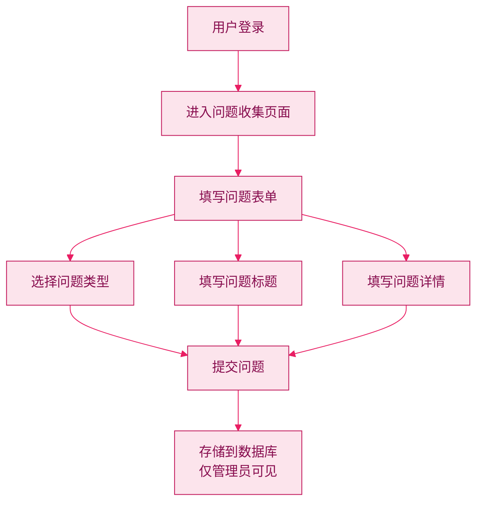
```mermaid
%%{init: {'theme':'base', 'themeVariables': {'primaryColor':'#fce4ec','primaryTextColor':'#880e4f','primaryBorderColor':'#c2185b','lineColor':'#e91e63','fontSize':'16px','fontFamily':'Microsoft YaHei'}}}%%
flowchart TD
    A[用户登录] --> B[进入问题收集页面]
    B --> C[填写问题表单]
    C --> D[选择问题类型]
    C --> E[填写问题标题]
    C --> F[填写问题详情]
    D --> G[提交问题]
    E --> G
    F --> G
    G --> H[存储到数据库<br/>仅管理员可见]
```

**图4-9 问题处理流程**

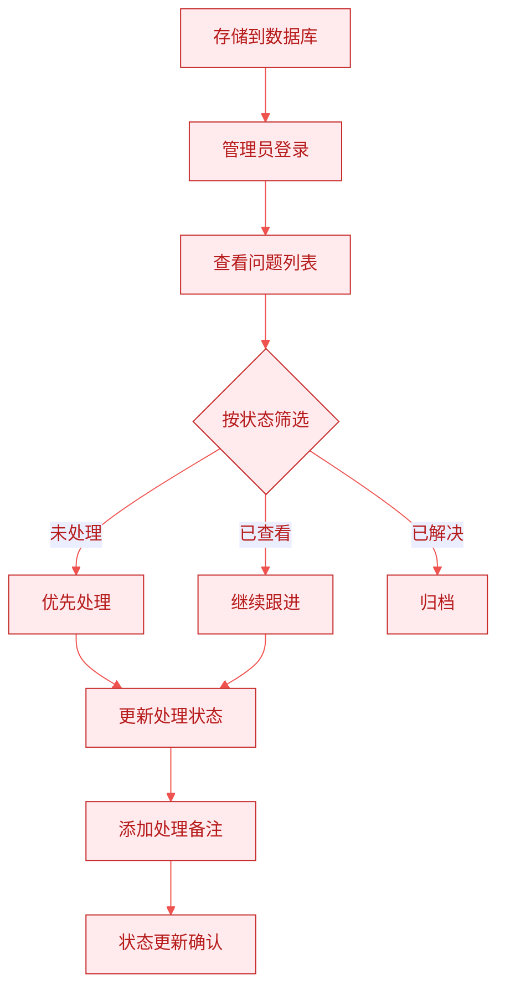
```mermaid
%%{init: {'theme':'base', 'themeVariables': {'primaryColor':'#ffebee','primaryTextColor':'#b71c1c','primaryBorderColor':'#c62828','lineColor':'#ef5350','fontSize':'16px','fontFamily':'Microsoft YaHei'}}}%%
flowchart TD
    H[存储到数据库] --> I[管理员登录]
    I --> J[查看问题列表]
    J --> K{按状态筛选}
    K -->|未处理| L[优先处理]
    K -->|已查看| M[继续跟进]
    K -->|已解决| N[归档]
    L --> O[更新处理状态]
    M --> O
    O --> P[添加处理备注]
    P --> Q[状态更新确认]
```

#### 4.4.2 详细流程说明

| 步骤 | 操作说明 | 参与角色 | 输入 | 输出 |
|------|----------|----------|------|------|
| 1 | 用户登录系统 | 一般用户/管理员 | 用户名、密码 | 登录成功 |
| 2 | 点击"问题收集"导航 | 一般用户/管理员 | 点击操作 | 进入问题收集页面 |
| 3 | 填写问题表单 | 一般用户/管理员 | 问题类型、问题详情 | 表单数据 |
| 4 | 提交问题 | 一般用户/管理员 | 提交操作 | 提交成功提示 |
| 5 | 系统存储问题数据 | 系统 | 问题数据、提交时间 | 数据库存储确认 |
| 6 | 管理员登录系统 | 管理员 | 用户名、密码 | 登录成功 |
| 7 | 管理员查看问题列表 | 管理员 | 点击操作 | 问题列表（含未处理/已查看/已解决） |
| 8 | 管理员选择问题处理 | 管理员 | 选择问题ID | 进入问题详情页 |
| 9 | 管理员更新处理状态 | 管理员 | 新状态、处理备注 | 状态更新确认 |
| 10 | 一般用户查看个人问题状态 | 一般用户 | 点击操作 | 个人提交的问题列表 |

#### 4.4.3 问题处理状态流转

**图4-10 问题状态流转图**

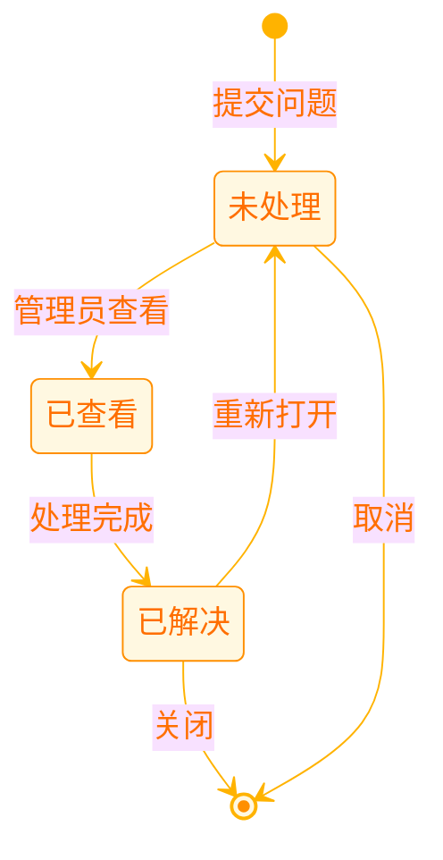
```mermaid
%%{init: {'theme':'base', 'themeVariables': {'primaryColor':'#fff8e1','primaryTextColor':'#ff6f00','primaryBorderColor':'#ff8f00','lineColor':'#ffb300','fontSize':'18px','fontFamily':'Microsoft YaHei'}}}%%
stateDiagram-v2
    [*] --> 未处理: 提交问题
    未处理 --> 已查看: 管理员查看
    已查看 --> 已解决: 处理完成
    已解决 --> 未处理: 重新打开
    已解决 --> [*]: 关闭
    未处理 --> [*]: 取消
```

### 4.5 流程4：页面跳转流程

#### 4.5.1 系统页面结构

**图4-11 系统页面导航结构**

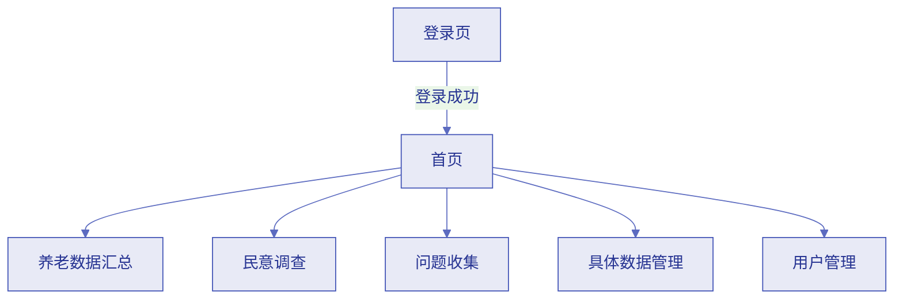
```mermaid
%%{init: {'theme':'base', 'themeVariables': {'primaryColor':'#e8eaf6','primaryTextColor':'#283593','primaryBorderColor':'#3f51b5','lineColor':'#5c6bc0','fontSize':'16px','fontFamily':'Microsoft YaHei'}}}%%
graph TB
    Login[登录页] -->|登录成功| Home[首页]
    Home --> DataSummary[养老数据汇总]
    Home --> Survey[民意调查]
    Home --> Issue[问题收集]
    Home --> DataManage[具体数据管理]
    Home --> UserManage[用户管理]
```

**图4-12 页面返回关系**

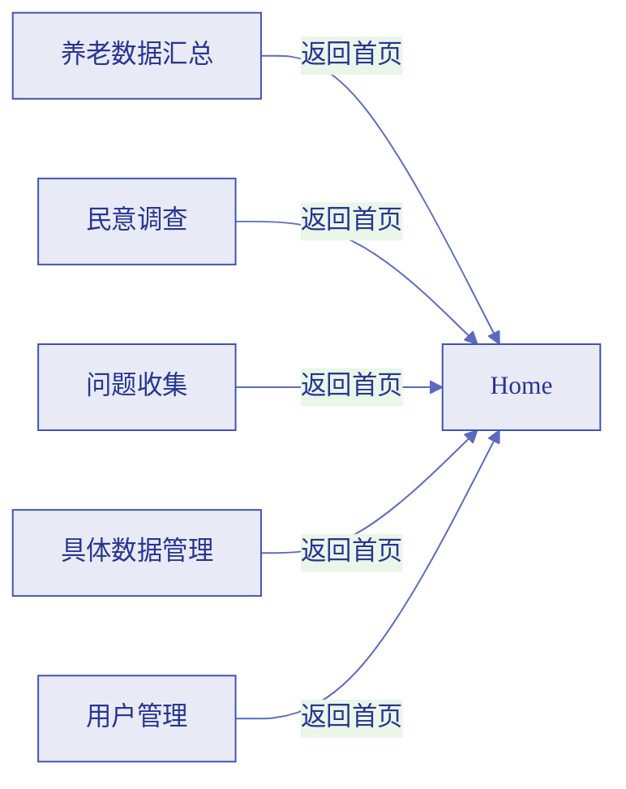
```mermaid
%%{init: {'theme':'base', 'themeVariables': {'primaryColor':'#e8eaf6','primaryTextColor':'#283593','primaryBorderColor':'#3f51b5','lineColor':'#5c6bc0','fontSize':'16px','fontFamily':'Microsoft YaHei'}}}%%
graph LR
    DataSummary[养老数据汇总] -->|返回首页| Home
    Survey[民意调查] -->|返回首页| Home
    Issue[问题收集] -->|返回首页| Home
    DataManage[具体数据管理] -->|返回首页| Home
    UserManage[用户管理] -->|返回首页| Home
```

> 注：具体数据管理和用户管理页面仅管理员可见，在图中用绿色标识。

#### 4.5.2 页面跳转规则

| 当前页面 | 目标页面 | 跳转条件 | 跳转方式 |
|----------|----------|----------|----------|
| 登录页 | 首页 | 登录成功 | 自动跳转 |
| 首页 | 养老数据汇总 | 点击导航 | 导航链接 |
| 首页 | 民意调查 | 点击导航 | 导航链接 |
| 首页 | 问题收集 | 点击导航 | 导航链接 |
| 首页 | 具体数据管理 | 点击导航 | 导航链接（仅管理员可见） |
| 任意子页面 | 首页 | 点击"返回首页" | 返回链接 |
| 任意子页面 | 登录页 | 点击"退出登录" | 退出操作 |

### 4.6 业务流程间关系

**图4-13 业务流程关系图**

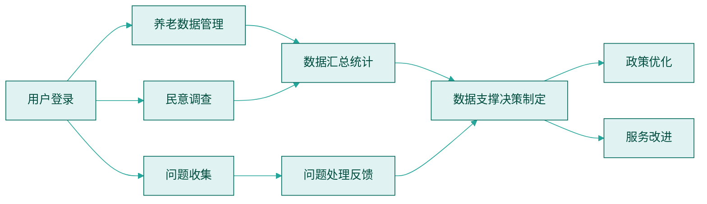
```mermaid
%%{init: {'theme':'base', 'themeVariables': {'primaryColor':'#e0f2f1','primaryTextColor':'#004d40','primaryBorderColor':'#00695c','lineColor':'#26a69a','fontSize':'16px','fontFamily':'Microsoft YaHei'}}}%%
graph LR
    User[用户登录] --> Data[养老数据管理]
    User --> Survey[民意调查]
    User --> Issue[问题收集]
    Data --> Summary[数据汇总统计]
    Survey --> Summary
    Issue --> Process[问题处理反馈]
    Summary --> Decision[数据支撑决策制定]
    Process --> Decision
    Decision --> Policy[政策优化]
    Decision --> Service[服务改进]
```

---

## 5. 数据

### 5.1 数据概述

系统数据分为四大类别：
1. **核心养老数据**：老年人个人信息及养老状况数据
2. **民意调查数据**：用户填写的民意调查反馈数据
3. **问题收集数据**：用户提交的养老问题及建议数据
4. **用户账号数据**：系统用户认证及权限管理数据

### 5.2 核心养老数据

#### 5.2.1 数据表设计

| 字段序号 | 字段名称 | 字段代码 | 数据类型 | 长度 | 可空 | 默认值 | 说明 |
|----------|----------|----------|----------|------|------|--------|------|
| 1 | 数据ID | `id` | BIGINT | - | 否 | 自增 | 主键，唯一标识 |
| 2 | 姓名 | `name` | VARCHAR | 50 | 否 | - | 老年人姓名 |
| 3 | 身份证号 | `id_card` | VARCHAR | 18 | 否 | - | 唯一标识，用于数据去重 |
| 4 | 年龄 | `age` | INT | - | 否 | - | 老年人年龄 |
| 5 | 性别 | `gender` | ENUM | - | 否 | - | 男/女/其他 |
| 6 | 住址 | `address` | VARCHAR | 200 | 否 | - | 详细到乡镇/社区 |
| 7 | 区域类型 | `area_type` | ENUM | - | 否 | - | 城镇/乡镇 |
| 8 | 家庭人口数 | `family_size` | INT | - | 是 | 0 | 家庭总人数 |
| 9 | 有无子女 | `has_children` | ENUM | - | 否 | - | 有/无/不详 |
| 10 | 子女数量 | `children_count` | INT | - | 是 | 0 | 有子女时填写 |
| 11 | 有无工作 | `has_job` | ENUM | - | 否 | - | 有/无/已退休 |
| 12 | 有无退休金 | `has_pension` | ENUM | - | 否 | - | 有/无 |
| 13 | 有无养老保险 | `has_insurance` | ENUM | - | 否 | - | 有/无 |
| 14 | 保险类型 | `insurance_type` | VARCHAR | 50 | 是 | NULL | 城乡居民/职工养老 |
| 15 | 每月养老金金额 | `pension_amount` | DECIMAL | (10,2) | 否 | 0.00 | 单位：元 |
| 16 | 有无疾病 | `has_disease` | ENUM | - | 否 | - | 有/无 |
| 17 | 疾病类型 | `disease_type` | VARCHAR | 200 | 是 | NULL | 多种疾病用逗号分隔 |
| 18 | 子女赡养费金额 | `support_amount` | DECIMAL | (10,2) | 否 | 0.00 | 赡养费金额 |
| 19 | 赡养费周期 | `support_period` | ENUM | - | 是 | 月 | 按月/按年 |
| 20 | 婚姻状况 | `marital_status` | ENUM | - | 否 | - | 未婚/已婚/丧偶/离异 |
| 21 | 联系方式 | `contact` | VARCHAR | 20 | 是 | NULL | 手机号/家庭电话 |
| 22 | 数据录入时间 | `created_at` | DATETIME | - | 否 | NOW() | 用于数据溯源 |
| 23 | 数据更新时间 | `updated_at` | DATETIME | - | 否 | NOW() | 记录修改时间 |
| 24 | 录入人ID | `created_by` | BIGINT | - | 是 | NULL | 关联用户表 |

#### 5.2.2 字段详细说明

**个人信息类字段**
- **姓名**：必填，老年人真实姓名
- **身份证号**：必填，唯一标识，18位身份证号码，用于数据去重和身份验证
- **年龄**：必填，整数，60周岁及以上
- **性别**：必填，枚举值（男/女/其他）

**住址信息类字段**
- **住址**：必填，详细地址，需包含省/市/区/乡镇/社区信息
- **区域类型**：必填，区分城镇/乡镇，用于分类统计

**家庭状况类字段**
- **家庭人口数**：可选，填写则需大于等于1
- **有无子女**：必填，有/无/不详
- **子女数量**：当"有无子女"选择"有"时建议填写
- **婚姻状况**：必填，未婚/已婚/丧偶/离异

**经济状况类字段**
- **有无工作**：必填，有/无/已退休
- **有无退休金**：必填，有/无
- **每月养老金金额**：必填，无则填0，单位：元
- **有无养老保险**：必填，有/无
- **保险类型**：有养老保险时填写，城乡居民/职工养老/其他
- **子女赡养费金额**：必填，无则填0
- **赡养费周期**：默认按月，可选按年

**健康医疗类字段**
- **有无疾病**：必填，有/无
- **疾病类型**：有疾病时建议填写，可填写多种疾病（如高血压、糖尿病等）

**联系方式类字段**
- **联系方式**：可选，手机号或家庭电话，仅管理员可见

**系统管理类字段**
- **数据录入时间**：自动生成，记录数据首次录入时间
- **数据更新时间**：自动更新，记录数据最后一次修改时间
- **录入人ID**：关联用户表，记录数据录入操作人

#### 5.2.3 数据隐私分级

| 隐私级别 | 字段 | 可见性 |
|----------|------|--------|
| **公开数据（汇总统计）** | 年龄分布、性别比例、区域分布、养老金均值、疾病占比等 | 所有用户可见 |
| **敏感数据（仅管理员可见）** | 姓名、身份证号、详细住址、联系方式、子女数量、具体养老金金额 | 仅管理员可见 |
| **统计数据（自动计算）** | 各地区老年人数量、平均年龄、养老金平均水平、疾病类型分布 | 所有用户可见 |

#### 5.2.4 数据示例

```json
{
  "name": "张三",
  "id_card": "123456195001011234",
  "age": 75,
  "gender": "男",
  "address": "XX省XX市XX区XX街道XX社区",
  "area_type": "城镇",
  "family_size": 3,
  "has_children": "有",
  "children_count": 1,
  "has_job": "已退休",
  "has_pension": "有",
  "has_insurance": "有",
  "insurance_type": "职工养老",
  "pension_amount": 4500.00,
  "has_disease": "有",
  "disease_type": "高血压,糖尿病",
  "support_amount": 500.00,
  "support_period": "月",
  "marital_status": "已婚",
  "contact": "13800138000",
  "created_at": "2026-01-15 10:30:00",
  "created_by": 1
}
```

### 5.3 民意调查数据

#### 5.3.1 数据表设计

| 字段序号 | 字段名称 | 字段代码 | 数据类型 | 长度 | 可空 | 默认值 | 说明 |
|----------|----------|----------|----------|------|------|--------|------|
| 1 | 调查ID | `id` | BIGINT | - | 否 | 自增 | 主键 |
| 2 | 填写人ID | `user_id` | BIGINT | - | 是 | NULL | 关联用户表，匿名则为空 |
| 3 | 每月开销构成-餐饮 | `expense_food` | DECIMAL | (5,2) | 否 | 0 | 占比百分比 |
| 4 | 每月开销构成-医疗 | `expense_medical` | DECIMAL | (5,2) | 否 | 0 | 占比百分比 |
| 5 | 每月开销构成-购物 | `expense_shopping` | DECIMAL | (5,2) | 否 | 0 | 占比百分比 |
| 6 | 每月开销构成-娱乐 | `expense_entertainment` | DECIMAL | (5,2) | 否 | 0 | 占比百分比 |
| 7 | 每月开销构成-其他 | `expense_other` | DECIMAL | (5,2) | 否 | 0 | 占比百分比 |
| 8 | 急需解决问题 | `urgent_issue` | VARCHAR | 50 | 否 | - | 医疗/养老/经济/其他 |
| 9 | 养老院意愿 | `nursing_home_willing` | ENUM | - | 否 | - | 愿意/不愿意/视情况而定 |
| 10 | 政策建议 | `suggestion` | TEXT | - | 是 | NULL | 文本内容 |
| 11 | 填写时间 | `created_at` | DATETIME | - | 否 | NOW() | 自动生成 |
| 12 | IP地址 | `ip_address` | VARCHAR | 50 | 是 | NULL | 记录提交IP（可选） |

#### 5.3.2 字段详细说明

**开销构成字段**
- 五项开销占比之和应为100%
- 餐饮：日常饮食支出
- 医疗：看病买药支出
- 购物：日用品购买支出
- 娱乐：休闲娱乐支出
- 其他：其他类型支出

**急需解决问题选项**
- 医疗报销：医疗费用报销问题
- 养老服务：社区养老服务问题
- 经济困难：养老金/经济来源问题
- 陪伴照护：日常照护和陪伴需求
- 其他：其他问题

**养老院意愿**
- 愿意：愿意入住养老院
- 不愿意：不愿意入住养老院
- 视情况而定：根据条件决定

#### 5.3.3 汇总统计字段

系统自动生成的统计数据：

| 统计项 | 计算方式 | 展示形式 |
|--------|----------|----------|
| 平均开销构成 | 各项开销的平均值 | 表格/饼图 |
| 急需问题排行 | 各问题选项的选择次数和占比 | 柱状图 |
| 养老院接受度 | 各选项的选择占比 | 饼图 |
| 地区差异分析 | 按用户所属地区分组统计 | 对比图 |

### 5.4 问题收集数据

#### 5.4.1 数据表设计

| 字段序号 | 字段名称 | 字段代码 | 数据类型 | 长度 | 可空 | 默认值 | 说明 |
|----------|----------|----------|----------|------|------|--------|------|
| 1 | 问题ID | `id` | BIGINT | - | 否 | 自增 | 主键 |
| 2 | 提交人ID | `user_id` | BIGINT | - | 否 | - | 关联用户表 |
| 3 | 问题类型 | `issue_type` | VARCHAR | 50 | 否 | - | 经济困难/服务缺失/政策疑问/其他 |
| 4 | 问题标题 | `title` | VARCHAR | 200 | 否 | - | 问题简要标题 |
| 5 | 问题详情 | `description` | TEXT | - | 否 | - | 问题详细描述 |
| 6 | 提交时间 | `created_at` | DATETIME | - | 否 | NOW() | 自动生成 |
| 7 | 处理状态 | `status` | ENUM | - | 否 | 未处理 | 未处理/已查看/已解决 |
| 8 | 处理备注 | `handle_note` | TEXT | - | 是 | NULL | 管理员处理说明 |
| 9 | 处理时间 | `handled_at` | DATETIME | - | 是 | NULL | 最后处理时间 |
| 10 | 处理人ID | `handled_by` | BIGINT | - | 是 | NULL | 处理问题的管理员ID |

#### 5.4.2 字段详细说明

**问题类型分类**
- 经济困难：养老金不足、医疗费用负担重等
- 服务缺失：社区养老服务不完善、上门服务缺失等
- 政策疑问：养老政策不了解、报销流程不清楚等
- 设施问题：养老设施不足、无障碍设施缺失等
- 其他：其他类型问题

**处理状态说明**
- 未处理：新提交的问题，管理员尚未查看
- 已查看：管理员已查看，正在处理中
- 已解决：问题已处理完成
- 已关闭：问题无法解决或已过期

#### 5.4.3 数据权限

- **一般用户**：仅可查看自己提交的问题及处理状态
- **管理员**：可查看所有用户提交的问题，并可更新处理状态和添加处理备注

### 5.5 用户账号数据

#### 5.5.1 数据表设计

| 字段序号 | 字段名称 | 字段代码 | 数据类型 | 长度 | 可空 | 默认值 | 说明 |
|----------|----------|----------|----------|------|------|--------|------|
| 1 | 用户ID | `id` | BIGINT | - | 否 | 自增 | 主键 |
| 2 | 用户名 | `username` | VARCHAR | 50 | 否 | - | 登录名，唯一 |
| 3 | 密码 | `password` | VARCHAR | 255 | 否 | - | 加密存储 |
| 4 | 手机号 | `phone` | VARCHAR | 20 | 是 | NULL | 联系方式 |
| 5 | 邮箱 | `email` | VARCHAR | 100 | 是 | NULL | 邮箱地址 |
| 6 | 真实姓名 | `real_name` | VARCHAR | 50 | 是 | NULL | 真实姓名 |
| 7 | 角色 | `role` | ENUM | - | 否 | 一般用户 | 一般用户/管理员 |
| 8 | 账号状态 | `is_active` | BOOLEAN | - | 否 | TRUE | 启用/禁用 |
| 9 | 注册时间 | `created_at` | DATETIME | - | 否 | NOW() | 自动生成 |
| 10 | 最后登录时间 | `last_login` | DATETIME | - | 是 | NULL | 记录登录时间 |

#### 5.5.2 字段详细说明

**用户名规则**
- 长度：4-20个字符
- 允许字符：字母、数字、下划线
- 唯一性：系统内不可重复

**密码规则**
- 加密方式：bcrypt算法
- 最小长度：8个字符
- 复杂度要求：建议包含字母和数字

**角色说明**
- 一般用户：默认角色，可查看汇总数据、填写调查、提交问题
- 管理员：拥有所有权限，可管理数据、处理问题、管理用户

### 5.6 数据库表关系图

**图5-1 用户表与其他表的关系**

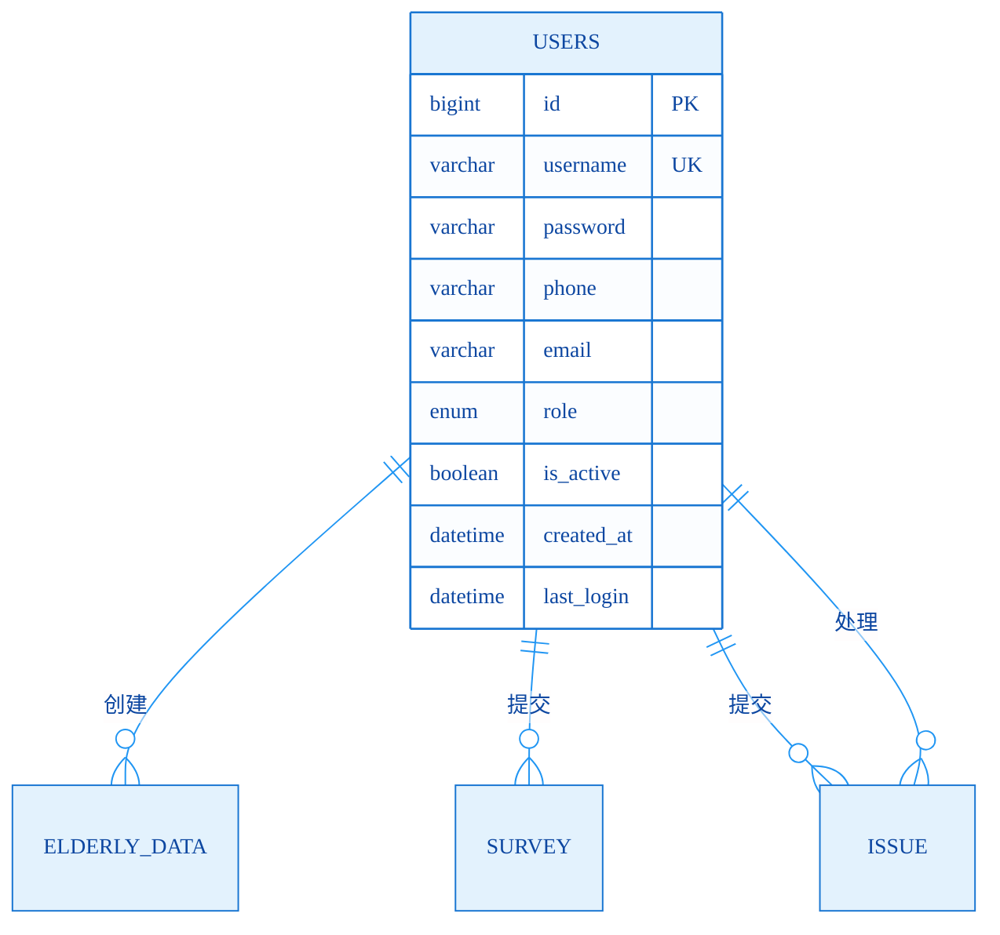
```mermaid
%%{init: {'theme':'base', 'themeVariables': {'primaryColor':'#e3f2fd','primaryTextColor':'#0d47a1','primaryBorderColor':'#1976d2','lineColor':'#2196f3','fontSize':'14px','fontFamily':'Microsoft YaHei'}}}%%
erDiagram
    USERS ||--o{ ELDERLY_DATA : 创建
    USERS ||--o{ SURVEY : 提交
    USERS ||--o{ ISSUE : 提交
    USERS ||--o{ ISSUE : 处理
    USERS {
        bigint id PK
        varchar username UK
        varchar password
        varchar phone
        varchar email
        enum role
        boolean is_active
        datetime created_at
        datetime last_login
    }
```

**图5-2 养老数据表结构**

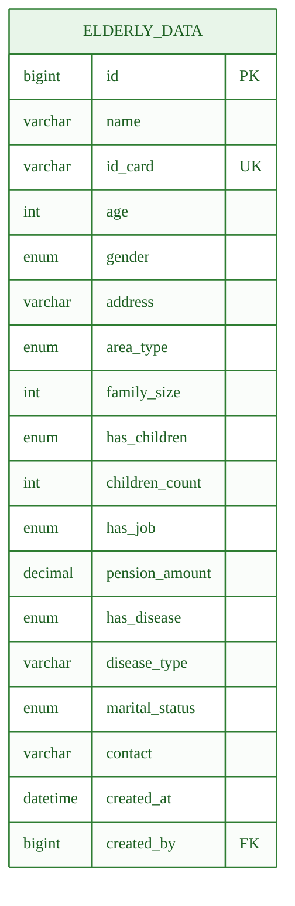
```mermaid
%%{init: {'theme':'base', 'themeVariables': {'primaryColor':'#e8f5e9','primaryTextColor':'#1b5e20','primaryBorderColor':'#2e7d32','lineColor':'#4caf50','fontSize':'14px','fontFamily':'Microsoft YaHei'}}}%%
erDiagram
    ELDERLY_DATA {
        bigint id PK
        varchar name
        varchar id_card UK
        int age
        enum gender
        varchar address
        enum area_type
        int family_size
        enum has_children
        int children_count
        enum has_job
        decimal pension_amount
        enum has_disease
        varchar disease_type
        enum marital_status
        varchar contact
        datetime created_at
        bigint created_by FK
    }
```

**图5-3 民意调查表结构**

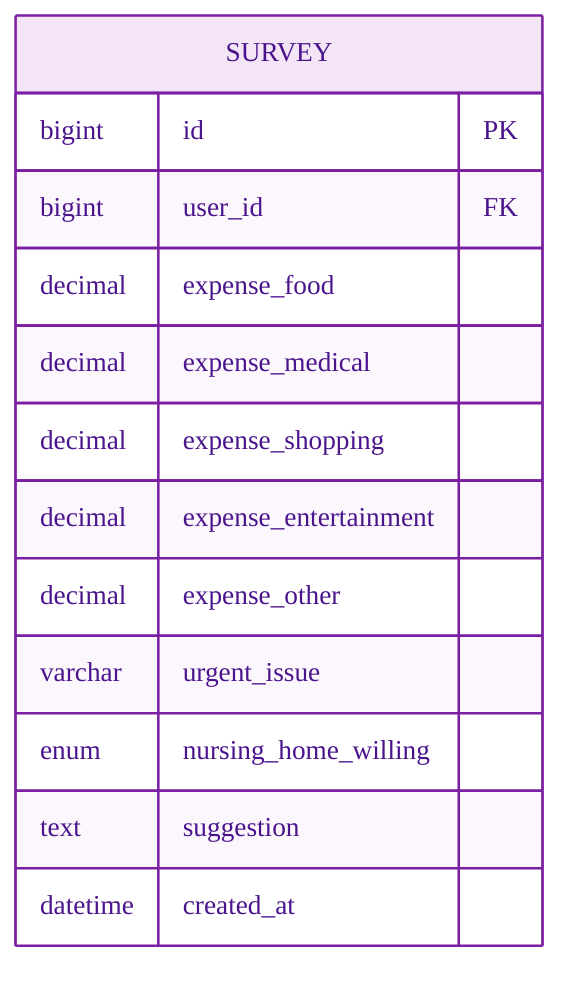
```mermaid
%%{init: {'theme':'base', 'themeVariables': {'primaryColor':'#f3e5f5','primaryTextColor':'#4a148c','primaryBorderColor':'#7b1fa2','lineColor':'#9c27b0','fontSize':'14px','fontFamily':'Microsoft YaHei'}}}%%
erDiagram
    SURVEY {
        bigint id PK
        bigint user_id FK
        decimal expense_food
        decimal expense_medical
        decimal expense_shopping
        decimal expense_entertainment
        decimal expense_other
        varchar urgent_issue
        enum nursing_home_willing
        text suggestion
        datetime created_at
    }
```

**图5-4 问题收集表结构**

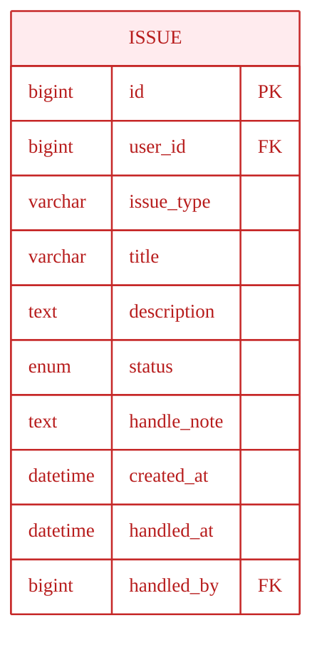
```mermaid
%%{init: {'theme':'base', 'themeVariables': {'primaryColor':'#ffebee','primaryTextColor':'#b71c1c','primaryBorderColor':'#c62828','lineColor':'#f44336','fontSize':'14px','fontFamily':'Microsoft YaHei'}}}%%
erDiagram
    ISSUE {
        bigint id PK
        bigint user_id FK
        varchar issue_type
        varchar title
        text description
        enum status
        text handle_note
        datetime created_at
        datetime handled_at
        bigint handled_by FK
    }
```

**表关系说明**：
- `USERS`表与`ELDERLY_DATA`表：一对多关系，一个用户可创建多条养老数据
- `USERS`表与`SURVEY`表：一对多关系，一个用户可提交多份调查问卷
- `USERS`表与`ISSUE`表：一对多关系（提交），一个用户可提交多个问题
- `USERS`表与`ISSUE`表：一对多关系（处理），一个管理员可处理多个问题

### 5.7 数据字典

#### 5.7.1 枚举值定义

**性别(gender)**
| 值 | 说明 |
|----|------|
| 男 | 男性 |
| 女 | 女性 |
| 其他 | 其他性别 |

**区域类型(area_type)**
| 值 | 说明 |
|----|------|
| 城镇 | 城镇地区 |
| 乡镇 | 乡镇地区 |

**有无选项**
| 值 | 说明 |
|----|------|
| 有 | 表示拥有 |
| 无 | 表示没有 |
| 不详 | 情况不明 |

**有无工作(has_job)**
| 值 | 说明 |
|----|------|
| 有 | 目前有工作 |
| 无 | 目前无工作 |
| 已退休 | 已办理退休 |

**婚姻状况(marital_status)**
| 值 | 说明 |
|----|------|
| 未婚 | 从未结婚 |
| 已婚 | 目前已婚 |
| 丧偶 | 配偶去世 |
| 离异 | 已离婚 |

**用户角色(role)**
| 值 | 说明 |
|----|------|
| 一般用户 | 普通用户权限 |
| 管理员 | 管理员权限 |

**处理状态(status)**
| 值 | 说明 |
|----|------|
| 未处理 | 新提交，尚未处理 |
| 已查看 | 管理员已查看 |
| 已解决 | 问题已解决 |
| 已关闭 | 问题已关闭 |

---

## 6. 外部接口

### 6.1 接口概述

系统主要包含以下几类外部接口：

| 接口类型 | 说明 | 优先级 |
|----------|------|--------|
| 数据库连接接口 | MySQL数据库连接 | 核心 |
| 用户认证接口 | 登录、注册、权限校验 | 核心 |
| 页面路由接口 | 前端页面跳转路由 | 核心 |
| 数据导出接口 | 数据导出为Excel/CSV | 扩展 |
| 政务系统对接接口 | 对接政务平台（后期） | 可选 |

### 6.2 核心接口

#### 6.2.1 SQLite数据库连接接口

**接口说明**：系统通过GORM与SQLite数据库进行交互。

**技术实现**：
- **数据库**：SQLite 3.x
- **连接库**：`gorm.io/driver/sqlite`
- **ORM框架**：GORM v1.25+
- **连接方式**：文件型数据库，无需独立服务

**配置示例**（database/db.go）：
```go
package database

import (
    "gorm.io/driver/sqlite"
    "gorm.io/gorm"
    "gorm.io/gorm/logger"
)

// InitDB 初始化数据库连接
func InitDB(dbPath string) (*gorm.DB, error) {
    db, err := gorm.Open(sqlite.Open(dbPath), &gorm.Config{
        Logger: logger.Default.LogMode(logger.Info),
    })
    if err != nil {
        return nil, err
    }
    return db, nil
}
```

**管理工具**：
- 数据库管理：Navicat Premium / DB Browser for SQLite
- 数据库备份：直接复制.db文件

#### 6.2.2 用户认证接口

**接口说明**：使用bcrypt加密和自定义JWT实现用户认证。

**主要功能**：
1. 用户注册
2. 用户登录
3. 用户登出
4. 密码修改
5. 权限校验
6. 会话管理

**API端点**：

| 功能 | 端点 | 方法 | 说明 |
|------|------|------|------|
| 注册 | `/register/` | POST | 创建新用户 |
| 登录 | `/login/` | POST | 用户登录 |
| 登出 | `/logout/` | POST | 用户登出 |
| 修改密码 | `/change-password/` | POST | 修改当前用户密码 |
| 权限校验 | 装饰器`@login_required` | - | 视图函数权限校验 |

**登录请求示例**：
```http
POST /login/
Content-Type: application/json

{
    "username": "admin",
    "password": "password123"
}
```

**登录响应示例**：
```json
{
    "code": 200,
    "message": "登录成功",
    "data": {
        "user_id": 1,
        "username": "admin",
        "role": "管理员"
    }
}
```

#### 6.2.3 页面路由接口

**接口说明**：前端通过Vue Router实现页面跳转。

**路由配置**（router/index.ts）：
```typescript
import { createRouter, createWebHashHistory } from 'vue-router'

const routes = [
  { path: '/', component: () => import('@/views/Home.vue'), meta: { title: '首页' } },
  { path: '/login', component: () => import('@/views/Login.vue'), meta: { title: '登录' } },
  { path: '/register', component: () => import('@/views/Register.vue'), meta: { title: '注册' } },
  { path: '/data-summary', component: () => import('@/views/DataSummary.vue'), meta: { requiresAuth: true, title: '数据汇总' } },
  { path: '/survey', component: () => import('@/views/Survey.vue'), meta: { requiresAuth: true, title: '民意调查' } },
  { path: '/issue', component: () => import('@/views/Issue.vue'), meta: { requiresAuth: true, title: '问题收集' } },
  { path: '/data-manage', component: () => import('@/views/DataManage.vue'), meta: { requiresAuth: true, requiresAdmin: true, title: '数据管理' } },
  { path: '/user-manage', component: () => import('@/views/UserManage.vue'), meta: { requiresAuth: true, requiresAdmin: true, title: '用户管理' } },
]

const router = createRouter({
  history: createWebHashHistory(),
  routes
})
```

**页面路由映射表**：

| 页面名称 | 路由路径 | 访问权限 | 说明 |
|----------|---------|----------|------|
| 首页 | `/` | 所有用户 | 系统首页 |
| 登录页 | `/login` | 未登录用户 | 用户登录 |
| 注册页 | `/register` | 未登录用户 | 用户注册 |
| 养老数据汇总 | `/data-summary` | 已登录用户 | 查看汇总统计 |
| 民意调查 | `/survey` | 已登录用户 | 填写/查看调查 |
| 问题收集 | `/issue` | 已登录用户 | 提交/查看问题 |
| 具体数据管理 | `/data-manage` | 管理员 | 养老数据CRUD |
| 用户管理 | `/user-manage` | 管理员 | 用户账号管理 |

#### 6.2.4 数据查询接口

**接口说明**：提供养老数据的查询接口。

**API端点**：

| 功能 | 端点 | 方法 | 访问权限 | 说明 |
|------|------|------|----------|------|
| 获取汇总统计 | `/api/summary/` | GET | 所有用户 | 获取养老数据汇总 |
| 获取具体数据 | `/api/elderly/` | GET | 管理员 | 获取具体养老数据列表 |
| 获取单条数据 | `/api/elderly/<id>/` | GET | 管理员 | 获取单条养老数据详情 |
| 创建养老数据 | `/api/elderly/` | POST | 管理员 | 录入新的养老数据 |
| 更新养老数据 | `/api/elderly/<id>/` | PUT | 管理员 | 更新养老数据 |
| 删除养老数据 | `/api/elderly/<id>/` | DELETE | 管理员 | 删除养老数据 |

**汇总统计请求示例**：
```http
GET /api/summary/?area_type=城镇&age_min=60&age_max=80
```

**汇总统计响应示例**：
```json
{
    "code": 200,
    "data": {
        "total_count": 1250,
        "age_distribution": {
            "60-70": 450,
            "70-80": 520,
            "80+": 280
        },
        "gender_ratio": {
            "男": 48.5,
            "女": 51.5
        },
        "pension_avg": 3850.00,
        "disease_rate": 62.3
    }
}
```

### 6.3 扩展接口

#### 6.3.1 数据导出接口

**接口说明**：管理员可将数据导出为Excel/CSV格式。

**API端点**：

| 功能 | 端点 | 方法 | 访问权限 | 说明 |
|------|------|------|----------|------|
| 导出养老数据 | `/api/export/elderly/` | GET | 管理员 | 导出Excel格式 |
| 导出调查数据 | `/api/export/survey/` | GET | 管理员 | 导出Excel格式 |
| 导出问题数据 | `/api/export/issue/` | GET | 管理员 | 导出Excel格式 |

**实现技术**：
- Python库：`openpyxl` 或 `pandas`
- 导出格式：.xlsx（Excel 2007+）、.csv
- 编码：UTF-8 with BOM（CSV）

#### 6.3.2 政务系统对接接口（后期扩展）

**接口说明**：后期可对接当地政务平台，同步养老政策数据。

**对接方式**：
- **数据推送**：系统定期将养老数据汇总推送到政务平台
- **数据拉取**：从政务平台拉取最新养老政策信息
- **单点登录**：与政务平台实现统一身份认证

**技术实现**：
- 通信协议：HTTPS
- 数据格式：JSON
- 认证方式：API Key / OAuth 2.0

**安全措施**：
- 数据传输加密（TLS）
- 接口访问频率限制
- 数据脱敏处理

### 6.4 接口安全规范

#### 6.4.1 认证与授权

| 安全措施 | 实现方式 |
|----------|----------|
| 用户认证 | JWT Token / 本地存储 |
| 密码加密 | bcrypt |
| 权限控制 | 路由守卫、角色验证 |
| 会话管理 | Token过期机制 |

#### 6.4.2 数据传输安全

| 安全措施 | 实现方式 |
|----------|----------|
| 传输加密 | HTTPS（生产环境） |
| 敏感数据脱敏 | 身份证号部分隐藏 |
| SQL注入防护 | GORM参数化查询 |
| XSS防护 | Vue3模板自动转义、输入过滤 |

#### 6.4.3 访问控制

| 安全措施 | 实现方式 |
|----------|----------|
| 登录验证 | 所有页面需登录后访问 |
| 权限验证 | 根据用户角色展示不同内容 |
| 操作日志 | 记录敏感操作（可选） |
| 异常登录检测 | 多次失败锁定账号（可选） |

---

## 7. 功能

### 7.1 功能概述

系统功能分为六大模块：

**图7-1 系统功能模块总览**

```mermaid
%%{init: {'theme':'base', 'themeVariables': {'primaryColor':'#e8eaf6','primaryTextColor':'#283593','primaryBorderColor':'#3f51b5','lineColor':'#5c6bc0','fontSize':'18px','fontFamily':'Microsoft YaHei'}}}%%
graph TB
    System[智慧养老数据库系统] --> Auth[用户认证模块]
    System --> DataManage[养老数据管理模块]
    System --> Survey[民意调查模块]
    System --> Issue[问题收集模块]
    System --> Account[账户管理模块]
    System --> Nav[页面导航模块]
```

**图7-2 用户认证模块功能**

```mermaid
%%{init: {'theme':'base', 'themeVariables': {'primaryColor':'#e3f2fd','primaryTextColor':'#0d47a1','primaryBorderColor':'#1976d2','lineColor':'#2196f3','fontSize':'16px','fontFamily':'Microsoft YaHei'}}}%%
graph LR
    Auth[用户认证模块] --> Register[用户注册]
    Auth --> Login[用户登录]
    Auth --> Logout[用户登出]
    Auth --> AuthCheck[权限校验]
```

**图7-3 养老数据管理模块功能**

```mermaid
%%{init: {'theme':'base', 'themeVariables': {'primaryColor':'#e8f5e9','primaryTextColor':'#1b5e20','primaryBorderColor':'#2e7d32','lineColor':'#4caf50','fontSize':'16px','fontFamily':'Microsoft YaHei'}}}%%
graph LR
    DataManage[养老数据管理模块] --> DataAdd[数据录入]
    DataManage --> DataQuery[数据查询]
    DataManage --> DataEdit[数据修改]
    DataManage --> DataDelete[数据删除]
    DataManage --> DataSummary[汇总统计]
```

**图7-4 民意调查与问题收集模块功能**

```mermaid
%%{init: {'theme':'base', 'themeVariables': {'primaryColor':'#f3e5f5','primaryTextColor':'#4a148c','primaryBorderColor':'#7b1fa2','lineColor':'#9c27b0','fontSize':'16px','fontFamily':'Microsoft YaHei'}}}%%
graph LR
    Survey[民意调查模块] --> SurveyFill[填写调查]
    Survey --> SurveyResult[结果汇总]
    Survey --> SurveyView[原始数据查看]
    Issue[问题收集模块] --> IssueSubmit[提交问题]
    Issue --> IssueView[查看问题]
    Issue --> IssueHandle[处理问题]
```

**图7-5 账户管理模块功能**

```mermaid
%%{init: {'theme':'base', 'themeVariables': {'primaryColor':'#fce4ec','primaryTextColor':'#880e4f','primaryBorderColor':'#c2185b','lineColor':'#e91e63','fontSize':'16px','fontFamily':'Microsoft YaHei'}}}%%
graph LR
    Account[账户管理模块] --> ModifyName[修改用户名]
    Account --> ModifyPassword[修改密码]
    Account --> DeleteSelf[注销自己的账号]
    Account --> UserStatus[查看用户状态-管理员]
    Account --> DeleteUser[注销用户账号-管理员]
```

**图7-6 页面导航模块功能**

```mermaid
%%{init: {'theme':'base', 'themeVariables': {'primaryColor':'#fff3e0','primaryTextColor':'#e65100','primaryBorderColor':'#ef6c00','lineColor':'#ff9800','fontSize':'16px','fontFamily':'Microsoft YaHei'}}}%%
graph LR
    Nav[页面导航模块] --> Menu[导航菜单]
    Nav --> Breadcrumb[面包屑导航]
    Nav --> Back[返回首页]
```

### 7.2 用户认证模块

#### 7.2.1 用户注册

**功能描述**：新用户通过注册页面创建系统账户。

| 项目 | 说明 |
|------|------|
| **功能名称** | 用户注册 |
| **访问权限** | 未登录用户 |
| **先决条件** | 无 |
| **输入** | 用户名（4-20字符）、密码（最少8字符）、确认密码、手机号（可选） |
| **输出** | 注册成功/失败提示信息 |
| **页面位置** | `/register/` |

**输入字段说明**：

| 字段名 | 类型 | 必填 | 验证规则 | 错误提示 |
|--------|------|------|----------|----------|
| 用户名 | 文本 | 是 | 4-20字符，仅允许字母、数字、下划线 | 用户名格式不正确 |
| 密码 | 密码 | 是 | 最少8字符 | 密码至少8个字符 |
| 确认密码 | 密码 | 是 | 与密码一致 | 两次密码不一致 |
| 手机号 | 文本 | 否 | 11位手机号 | 手机号格式不正确 |

**输出说明**：

| 场景 | 输出内容 |
|------|----------|
| 注册成功 | "注册成功！请登录" + 自动跳转到登录页 |
| 用户名已存在 | "该用户名已被注册" |
| 密码不一致 | "两次输入的密码不一致" |
| 其他错误 | "注册失败，请稍后重试" |

#### 7.2.2 用户登录

**功能描述**：已注册用户通过登录页面访问系统。

| 项目 | 说明 |
|------|------|
| **功能名称** | 用户登录 |
| **访问权限** | 未登录用户 |
| **先决条件** | 已注册账户 |
| **输入** | 用户名、密码 |
| **输出** | 登录成功跳转首页/失败提示 |
| **页面位置** | `/login/` |

**输入字段说明**：

| 字段名 | 类型 | 必填 | 验证规则 | 错误提示 |
|--------|------|------|----------|----------|
| 用户名 | 文本 | 是 | 已注册的用户名 | 请输入用户名 |
| 密码 | 密码 | 是 | 与注册密码一致 | 请输入密码 |
| 记住我 | 复选框 | 否 | - | - |

**输出说明**：

| 场景 | 输出内容 |
|------|----------|
| 登录成功 | 跳转到系统首页，显示欢迎信息 |
| 用户名不存在 | "用户名或密码错误" |
| 密码错误 | "用户名或密码错误" |
| 账号被禁用 | "该账号已被禁用，请联系管理员" |

**安全措施**：
- 密码错误5次锁定账号15分钟（可选）
- 记住我功能使用Cookie保持7天登录状态

#### 7.2.3 用户登出

**功能描述**：用户主动退出系统。

| 项目 | 说明 |
|------|------|
| **功能名称** | 用户登出 |
| **访问权限** | 已登录用户 |
| **先决条件** | 用户已登录 |
| **输入** | 点击"退出登录"按钮 |
| **输出** | 清除会话，跳转到登录页 |
| **页面位置** | `/logout/` |

**输出说明**：
- 清除用户会话数据
- 跳转到登录页
- 显示"已退出登录"提示

#### 7.2.4 权限校验

**功能描述**：系统根据用户角色展示不同的页面内容和功能。

| 项目 | 说明 |
|------|------|
| **功能名称** | 权限校验 |
| **访问权限** | 所有页面 |
| **先决条件** | 用户已登录 |
| **输入** | 用户角色（一般用户/管理员） |
| **输出** | 展示对应权限的页面内容 |

**权限规则**：

| 页面/功能 | 一般用户 | 管理员 |
|-----------|----------|--------|
| 查看养老数据汇总 | ✓ | ✓ |
| 查看具体养老数据 | ✗ | ✓ |
| 录入/修改/删除养老数据 | ✗ | ✓ |
| 查看民意调查汇总 | ✓ | ✓ |
| 查看民意调查原始数据 | ✗ | ✓ |
| 提交问题收集 | ✓ | ✓ |
| 查看所有问题收集 | ✗ | ✓ |
| 处理问题收集 | ✗ | ✓ |
| 用户管理 | ✗ | ✓ |

### 7.3 养老数据管理模块

#### 7.3.1 具体数据录入

**功能描述**：管理员录入新的老年人养老数据。

| 项目 | 说明 |
|------|------|
| **功能名称** | 养老数据录入 |
| **访问权限** | 管理员 |
| **先决条件** | 管理员已登录 |
| **输入** | 养老数据表单（姓名、身份证号、年龄等） |
| **输出** | 录入成功提示 + 数据存入数据库 |
| **页面位置** | `/data-manage/add/` |

**输入字段说明**：

| 字段名 | 类型 | 必填 | 验证规则 |
|--------|------|------|----------|
| 姓名 | 文本 | 是 | 2-50字符 |
| 身份证号 | 文本 | 是 | 18位，格式正确，唯一 |
| 年龄 | 数字 | 是 | 60-120之间 |
| 性别 | 下拉选择 | 是 | 男/女/其他 |
| 住址 | 文本 | 是 | 详细地址 |
| 区域类型 | 下拉选择 | 是 | 城镇/乡镇 |
| 家庭人口数 | 数字 | 否 | 正整数 |
| 有无子女 | 下拉选择 | 是 | 有/无/不详 |
| 子女数量 | 数字 | 条件必填 | 有子女时必填 |
| 有无工作 | 下拉选择 | 是 | 有/无/已退休 |
| 有无退休金 | 下拉选择 | 是 | 有/无 |
| 保险类型 | 下拉选择 | 条件必填 | 有养老保险时必填 |
| 每月养老金金额 | 数字 | 是 | ≥0 |
| 有无疾病 | 下拉选择 | 是 | 有/无 |
| 疾病类型 | 文本 | 条件必填 | 有疾病时建议填写 |
| 子女赡养费金额 | 数字 | 是 | ≥0 |
| 赡养费周期 | 下拉选择 | 是 | 按月/按年 |
| 婚姻状况 | 下拉选择 | 是 | 未婚/已婚/丧偶/离异 |
| 联系方式 | 文本 | 否 | 手机号或固话 |

**验证规则**：
- 身份证号格式验证（18位，最后一位可为X）
- 身份证号唯一性验证（数据库查询）
- 年龄范围验证（60-120岁）
- 手机号格式验证（11位数字）

**输出说明**：

| 场景 | 输出内容 |
|------|----------|
| 录入成功 | "数据录入成功！" + 返回数据列表 |
| 身份证号重复 | "该身份证号已存在！" |
| 必填字段为空 | "请填写所有必填字段" |
| 格式错误 | 具体字段的格式错误提示 |

#### 7.3.2 具体数据查询

**功能描述**：管理员查询、筛选养老数据。

| 项目 | 说明 |
|------|------|
| **功能名称** | 养老数据查询 |
| **访问权限** | 管理员 |
| **先决条件** | 管理员已登录 |
| **输入** | 查询条件（姓名、身份证号、地区等） |
| **输出** | 符合条件的数据列表 |
| **页面位置** | `/data-manage/` |

**查询条件**：

| 字段名 | 查询方式 | 说明 |
|--------|----------|------|
| 姓名 | 模糊查询 | 支持部分匹配 |
| 身份证号 | 精确查询 | 完全匹配 |
| 年龄范围 | 区间查询 | 最小值-最大值 |
| 性别 | 精确查询 | 男/女/其他 |
| 区域类型 | 精确查询 | 城镇/乡镇 |
| 住址 | 模糊查询 | 支持部分匹配 |
| 有无疾病 | 精确查询 | 有/无 |
| 录入时间 | 区间查询 | 起始-结束日期 |

**列表展示字段**：

| 字段名 | 说明 |
|--------|------|
| 姓名 | 老年人姓名 |
| 性别 | 性别 |
| 年龄 | 年龄 |
| 住址 | 住址（前20字符） |
| 养老金金额 | 每月养老金 |
| 有无疾病 | 是/否 |
| 录入时间 | 数据录入时间 |
| 操作 | 查看/编辑/删除按钮 |

**输出说明**：
- 分页展示（每页20条）
- 支持按字段排序
- 点击"查看"查看详细信息
- 点击"编辑"进入编辑页面
- 点击"删除"弹出确认对话框

#### 7.3.3 具体数据修改

**功能描述**：管理员修改已录入的养老数据。

| 项目 | 说明 |
|------|------|
| **功能名称** | 养老数据修改 |
| **访问权限** | 管理员 |
| **先决条件** | 管理员已登录，数据已存在 |
| **输入** | 数据ID、修改后的字段值 |
| **输出** | 修改成功提示 + 数据库更新 |
| **页面位置** | `/data-manage/edit/<id>/` |

**输入说明**：
- 页面自动加载原有数据
- 用户修改需要变更的字段
- 身份证号不允许修改（保持唯一性）
- 其他字段与录入时相同

**输出说明**：

| 场景 | 输出内容 |
|------|----------|
| 修改成功 | "数据修改成功！" + 返回数据列表 |
| 数据不存在 | "数据不存在或已被删除" |
| 无修改内容 | "未检测到任何修改" |

**版本控制（可选）**：
- 记录数据修改历史
- 保存修改人、修改时间
- 支持查看历史版本

#### 7.3.4 具体数据删除

**功能描述**：管理员删除错误的养老数据。

| 项目 | 说明 |
|------|------|
| **功能名称** | 养老数据删除 |
| **访问权限** | 管理员 |
| **先决条件** | 管理员已登录，数据已存在 |
| **输入** | 数据ID |
| **输出** | 删除成功提示 + 数据库删除 |
| **页面位置** | `/data-manage/delete/<id>/` |

**操作流程**：
1. 点击"删除"按钮
2. 弹出确认对话框："确定要删除该数据吗？"
3. 确认后执行删除
4. 显示删除结果

**输出说明**：

| 场景 | 输出内容 |
|------|----------|
| 删除成功 | "数据已删除" + 刷新列表 |
| 删除失败 | "删除失败，请稍后重试" |

**安全措施**：
- 二次确认防止误删
- 记录删除操作日志
- 软删除（标记为已删除，不物理删除）

#### 7.3.5 汇总数据展示

**功能描述**：一般用户和管理员查看养老数据的汇总统计结果。

| 项目 | 说明 |
|------|------|
| **功能名称** | 养老数据汇总 |
| **访问权限** | 所有已登录用户 |
| **先决条件** | 用户已登录 |
| **输入** | 筛选条件（地区、年龄等） |
| **输出** | 可视化汇总结果（表格/图表） |
| **页面位置** | `/data-summary/` |

**筛选条件**：

| 字段名 | 选项 | 说明 |
|--------|------|------|
| 区域类型 | 全部/城镇/乡镇 | 按地区筛选 |
| 年龄段 | 全部/60-70/70-80/80+ | 按年龄筛选 |
| 性别 | 全部/男/女 | 按性别筛选 |

**汇总统计项**：

| 统计项 | 说明 | 展示形式 |
|--------|------|----------|
| 总人数 | 符合条件的老年人总数 | 数字卡片 |
| 年龄分布 | 各年龄段人数占比 | 饼图/柱状图 |
| 性别比例 | 男女性别占比 | 饼图 |
| 区域分布 | 城镇/乡镇人数对比 | 柱状图 |
| 平均养老金 | 平均每月养老金金额 | 数字卡片 |
| 养老金区间 | 养老金分布区间 | 柱状图 |
| 疾病占比 | 有疾病老人的比例 | 进度条 |
| 疾病类型分布 | 各类疾病占比 | 柱状图 |
| 婚姻状况分布 | 各婚姻状况占比 | 饼图 |
| 有无子女比例 | 有/无子女老人占比 | 饼图 |

**数据导出**：
- 支持导出为Excel格式
- 导出内容包含当前筛选条件的汇总数据
- 包含图表图片

### 7.4 民意调查模块

#### 7.4.1 调查表单填写

**功能描述**：用户填写并提交民意调查表单。

| 项目 | 说明 |
|------|------|
| **功能名称** | 民意调查填写 |
| **访问权限** | 所有已登录用户 |
| **先决条件** | 用户已登录 |
| **输入** | 民意调查表单（开销构成、急需解决问题等） |
| **输出** | 提交成功提示 + 数据存入数据库 |
| **页面位置** | `/survey/` |

**输入字段说明**：

| 字段名 | 类型 | 必填 | 验证规则 | 说明 |
|--------|------|------|----------|------|
| 每月开销构成-餐饮 | 数字 | 是 | 0-100，整数 | 百分比 |
| 每月开销构成-医疗 | 数字 | 是 | 0-100，整数 | 百分比 |
| 每月开销构成-购物 | 数字 | 是 | 0-100，整数 | 百分比 |
| 每月开销构成-娱乐 | 数字 | 是 | 0-100，整数 | 百分比 |
| 每月开销构成-其他 | 数字 | 是 | 0-100，整数 | 百分比 |
| 急需解决的问题 | 下拉选择 | 是 | 单选 | 医疗/养老/经济/其他 |
| 是否愿意进养老院 | 下拉选择 | 是 | 单选 | 愿意/不愿意/视情况而定 |
| 政策/社区建议 | 文本域 | 否 | 最多500字 | 自由填写 |

**验证规则**：
- 五项开销占比之和必须等于100
- 各项开销占比为0-100之间的整数
- 必选下拉项必须选择

**输出说明**：

| 场景 | 输出内容 |
|------|----------|
| 提交成功 | "提交成功！感谢您的参与" |
| 开销总和不等于100 | "五项开销占比之和必须等于100%" |
| 必填项未填 | "请填写所有必填项" |

#### 7.4.2 调查结果汇总展示

**功能描述**：所有用户查看民意调查的汇总统计结果。

| 项目 | 说明 |
|------|------|
| **功能名称** | 民意调查汇总 |
| **访问权限** | 所有已登录用户 |
| **先决条件** | 用户已登录，有调查数据 |
| **输入** | 无（自动统计） |
| **输出** | 汇总结果（占比、排名等） |
| **页面位置** | `/survey/result/` |

**汇总统计项**：

| 统计项 | 计算方式 | 展示形式 |
|--------|----------|----------|
| 平均开销构成 | 各项开销的平均值 | 表格/饼图 |
| 急需问题排行 | 各选项的选择次数和占比 | 排行榜/柱状图 |
| 养老院接受度 | 各选项的选择占比 | 饼图 |
| 建议关键词云 | 从建议文本中提取关键词 | 词云图 |

#### 7.4.3 原始调查数据查看

**功能描述**：管理员查看所有用户提交的民意调查原始数据。

| 项目 | 说明 |
|------|------|
| **功能名称** | 原始调查数据查看 |
| **访问权限** | 管理员 |
| **先决条件** | 管理员已登录 |
| **输入** | 筛选条件（提交时间、问题类型等） |
| **输出** | 原始调查数据列表 |
| **页面位置** | `/survey/admin/` |

**筛选条件**：

| 字段名 | 查询方式 | 说明 |
|--------|----------|------|
| 提交时间 | 区间查询 | 起始-结束日期 |
| 急需问题 | 精确查询 | 医疗/养老/经济/其他 |
| 养老院意愿 | 精确查询 | 愿意/不愿意/视情况而定 |

**列表展示字段**：

| 字段名 | 说明 |
|--------|------|
| 问卷ID | 唯一标识 |
| 填写人 | 用户名 |
| 提交时间 | 填写时间 |
| 急需问题 | 选择的问题类型 |
| 养老院意愿 | 选择意愿 |
| 操作 | 查看详情按钮 |

### 7.5 问题收集模块

#### 7.5.1 问题提交

**功能描述**：用户填写并提交养老问题或建议。

| 项目 | 说明 |
|------|------|
| **功能名称** | 问题提交 |
| **访问权限** | 所有已登录用户 |
| **先决条件** | 用户已登录 |
| **输入** | 问题类型、问题标题、问题详情 |
| **输出** | 提交成功提示 + 数据存入数据库 |
| **页面位置** | `/issue/submit/` |

**输入字段说明**：

| 字段名 | 类型 | 必填 | 验证规则 | 说明 |
|--------|------|------|----------|------|
| 问题类型 | 下拉选择 | 是 | 单选 | 经济困难/服务缺失/政策疑问/其他 |
| 问题标题 | 文本 | 是 | 5-100字符 | 问题简要描述 |
| 问题详情 | 文本域 | 是 | 10-500字符 | 问题详细描述 |

**问题类型选项**：

| 选项 | 说明 | 示例 |
|------|------|------|
| 经济困难 | 养老金不足、医疗费用负担重 | 养老金不够支付医疗费 |
| 服务缺失 | 社区养老服务不完善 | 社区没有助餐服务 |
| 政策疑问 | 养老政策不了解、报销流程不清楚 | 不懂医保报销流程 |
| 设施问题 | 养老设施不足、无障碍设施缺失 | 小区没有无障碍通道 |
| 其他 | 其他类型问题 | ... |

**输出说明**：

| 场景 | 输出内容 |
|------|----------|
| 提交成功 | "问题已提交！我们会尽快处理" |
| 标题为空 | "请输入问题标题" |
| 详情为空 | "请输入问题详情" |
| 详情过短 | "问题详情至少10个字符" |

#### 7.5.2 问题查看

**功能描述**：管理员查看所有用户提交的问题。

| 项目 | 说明 |
|------|------|
| **功能名称** | 问题查看 |
| **访问权限** | 管理员 |
| **先决条件** | 管理员已登录 |
| **输入** | 筛选条件（状态、类型、时间） |
| **输出** | 问题列表 |
| **页面位置** | `/issue/admin/` |

**筛选条件**：

| 字段名 | 选项 | 说明 |
|--------|------|------|
| 处理状态 | 全部/未处理/已查看/已解决 | 按状态筛选 |
| 问题类型 | 全部/经济困难/服务缺失/政策疑问/其他 | 按类型筛选 |
| 提交时间 | 区间选择 | 按时间筛选 |

**列表展示字段**：

| 字段名 | 说明 |
|--------|------|
| 问题ID | 唯一标识 |
| 问题标题 | 问题简要标题 |
| 问题类型 | 类型标签 |
| 提交人 | 用户名 |
| 提交时间 | 提交时间 |
| 处理状态 | 状态标签（未处理/已查看/已解决） |
| 操作 | 查看详情/处理按钮 |

**状态标签样式**：

| 状态 | 颜色 | 样式 |
|------|------|------|
| 未处理 | 红色 | 高亮显示 |
| 已查看 | 黄色 | 常规显示 |
| 已解决 | 绿色 | 常规显示 |

#### 7.5.3 问题处理

**功能描述**：管理员更新问题的处理状态和添加处理备注。

| 项目 | 说明 |
|------|------|
| **功能名称** | 问题处理 |
| **访问权限** | 管理员 |
| **先决条件** | 管理员已登录，问题已存在 |
| **输入** | 处理状态、处理备注 |
| **输出** | 处理成功提示 + 状态更新 |
| **页面位置** | `/issue/handle/<id>/` |

**输入字段说明**：

| 字段名 | 类型 | 必填 | 说明 |
|--------|------|------|------|
| 处理状态 | 下拉选择 | 是 | 未处理/已查看/已解决 |
| 处理备注 | 文本域 | 否 | 处理说明或解决方案 |

**输出说明**：

| 场景 | 输出内容 |
|------|----------|
| 更新成功 | "状态已更新" + 返回列表 |
| 备注为空 | "请填写处理备注"（当状态改为已解决时） |

#### 7.5.4 个人问题查看

**功能描述**：一般用户查看自己提交的问题及处理状态。

| 项目 | 说明 |
|------|------|
| **功能名称** | 个人问题查看 |
| **访问权限** | 一般用户/管理员 |
| **先决条件** | 用户已登录 |
| **输入** | 无 |
| **输出** | 个人提交的问题列表 |
| **页面位置** | `/issue/my/` |

**列表展示字段**：

| 字段名 | 说明 |
|--------|------|
| 问题标题 | 问题简要标题 |
| 问题类型 | 类型标签 |
| 提交时间 | 提交时间 |
| 处理状态 | 状态标签 |
| 操作 | 查看详情按钮 |

### 7.6 账户管理模块

#### 7.6.1 修改用户名

**功能描述**：用户可以修改自己账号显示的用户名。

| 项目 | 说明 |
|------|------|
| **功能名称** | 修改用户名 |
| **访问权限** | 所有已登录用户 |
| **先决条件** | 用户已登录 |
| **输入** | 新用户名（2-20字符） |
| **输出** | 修改成功/失败提示 |

**输入字段说明**：

| 字段名 | 类型 | 必填 | 验证规则 | 错误提示 |
|--------|------|------|----------|----------|
| 新用户名 | 文本 | 是 | 2-20字符，仅允许字母、数字、下划线、中文 | 用户名格式不正确 |
| 确认密码 | 密码 | 是 | 与当前密码一致 | 密码错误，操作取消 |

**输出说明**：

| 场景 | 输出内容 |
|------|----------|
| 修改成功 | "用户名修改成功" + 刷新页面显示新用户名 |
| 用户名已存在 | "该用户名已被使用" |
| 密码错误 | "密码验证失败，操作已取消" |
| 其他错误 | "修改失败，请稍后重试" |

#### 7.6.2 注销自己的账号

**功能描述**：用户可以主动注销自己的账号，注销后账号不可恢复。

| 项目 | 说明 |
|------|------|
| **功能名称** | 注销账号 |
| **访问权限** | 所有已登录用户 |
| **先决条件** | 用户已登录 |
| **输入** | 点击"注销账号"按钮 + 二次确认 |
| **输出** | 账号注销成功 + 跳转登录页 |

**操作流程**：

1. 用户点击"注销账号"按钮
2. 系统显示警告提示："注销后您的所有数据将被永久删除，无法恢复！"
3. 用户输入"确认注销"文本进行二次确认
4. 系统执行注销操作：
   - 删除用户账号记录
   - 清除该用户的投票数据
   - 清除该用户提交的问题记录
   - 保留该用户提交的民意调查数据（用于统计）
5. 注销成功后跳转到登录页

**安全措施**：
- 需要输入当前密码验证身份
- 需要手动输入"确认注销"文本
- 显示明确的不可恢复警告
- 管理员账号不能被注销（需降级为一般用户后才能注销）

#### 7.6.3 用户状态管理（管理员）

**功能描述**：管理员可以查看所有用户的在线状态，并注销一般用户的账号。

| 项目 | 说明 |
|------|------|
| **功能名称** | 用户状态管理 |
| **访问权限** | 仅管理员 |
| **先决条件** | 管理员已登录 |
| **输入** | 查看用户列表、点击注销按钮 |
| **输出** | 用户状态列表、注销结果 |

**用户状态说明**：

| 状态 | 说明 | 显示方式 |
|------|------|----------|
| 在线 | 用户当前已登录且活跃 | 绿色圆点 + "在线" |
| 离线 | 用户已注册但当前未登录 | 灰色圆点 + "离线" |
| 注销 | 用户账号已被注销 | 红色圆点 + "已注销" |

**用户列表展示字段**：

| 字段名 | 说明 | 操作 |
|--------|------|------|
| 序号 | 连续序号 | - |
| 用户名 | 用户显示名称 | - |
| 角色 | 一般用户/管理员 | - |
| 状态 | 在线/离线/已注销 | - |
| 注册时间 | 账号注册时间 | - |
| 最后登录 | 最后登录时间 | - |
| 操作 | - | 注销按钮（管理员，非已注销用户） |

**注销用户账号操作**：

1. 管理员点击用户的"注销"按钮
2. 系统弹出确认对话框："确定要注销用户 [用户名] 的账号吗？注销后无法恢复！"
3. 管理员确认后执行注销
4. 该用户账号被标记为注销状态
5. 该用户无法再登录系统
6. 显示"账号已注销"提示

**限制**：
- 管理员不能注销自己的账号（需先降级为一般用户）
- 系统至少保留一个管理员账号
- 被注销账号的数据处理：
  - 个人数据保留（用于统计）
  - 登录权限被禁用
  - 提交的问题标记为"用户已注销"

#### 7.6.4 修改自己的密码

**功能描述**：用户可以修改自己的登录密码。

| 项目 | 说明 |
|------|------|
| **功能名称** | 修改密码 |
| **访问权限** | 所有已登录用户 |
| **先决条件** | 用户已登录 |
| **输入** | 当前密码、新密码、确认新密码 |
| **输出** | 修改成功/失败提示 |

**输入字段说明**：

| 字段名 | 类型 | 必填 | 验证规则 | 错误提示 |
|--------|------|------|----------|----------|
| 当前密码 | 密码 | 是 | 与当前密码一致 | 当前密码错误 |
| 新密码 | 密码 | 是 | 最少8字符 | 密码至少8个字符 |
| 确认新密码 | 密码 | 是 | 与新密码一致 | 两次密码不一致 |

### 7.7 页面导航模块

#### 7.7.1 导航菜单

**功能描述**：系统顶部导航栏，提供各功能模块的快速访问入口。

| 项目 | 说明 |
|------|------|
| **功能名称** | 导航菜单 |
| **访问权限** | 所有已登录用户 |
| **先决条件** | 用户已登录 |
| **输入** | 点击导航项 |
| **输出** | 跳转到对应页面 |

**导航菜单项**：

| 菜单项 | URL | 访问权限 | 说明 |
|--------|-----|----------|------|
| 首页 | `/` | 所有用户 | 系统首页 |
| 养老数据汇总 | `/data-summary/` | 所有用户 | 查看汇总统计 |
| 民意调查 | `/survey/` | 所有用户 | 填写/查看调查 |
| 问题收集 | `/issue/` | 所有用户 | 提交/查看问题 |
| 具体数据管理 | `/data-manage/` | 管理员 | 养老数据CRUD |
| 用户管理 | `/user-manage/` | 管理员 | 用户状态管理、注销用户账号 |
| 账户设置 | `/account/` | 所有用户 | 修改用户名、修改密码、注销账号 |

**菜单展示规则**：
- 管理员登录后，显示所有菜单项
- 一般用户登录后，隐藏管理员专属菜单项
- 当前页面对应的菜单项高亮显示

#### 7.7.2 面包屑导航

**功能描述**：页面顶部显示当前位置的路径导航。

```
首页 > 养老数据汇总
首页 > 民意调查 > 调查结果
首页 > 问题收集 > 我的问题
首页 > 具体数据管理 > 编辑数据
首页 > 用户管理 > 用户列表
首页 > 账户设置 > 修改用户名
首页 > 账户设置 > 修改密码
```

#### 7.7.3 返回首页

**功能描述**：任意页面提供"返回首页"按钮。

| 项目 | 说明 |
|------|------|
| **功能名称** | 返回首页 |
| **访问权限** | 所有已登录用户 |
| **先决条件** | 用户已登录 |
| **输入** | 点击"返回首页"按钮 |
| **输出** | 跳转到系统首页 |

---

## 8. 性能

### 8.1 性能指标

针对小型养老数据管理系统的性能要求，核心指标如下：

#### 8.1.1 响应速度

| 指标项 | 要求 | 说明 |
|--------|------|------|
| 页面加载时间 | ≤3秒 | 从点击链接到页面完全渲染完成 |
| 静态资源加载 | ≤2秒 | CSS、JS、图片等资源加载 |
| 数据查询响应 | ≤2秒 | 汇总统计查询 |
| 表单提交响应 | ≤1秒 | 表单提交后显示结果 |
| 登录/登出响应 | ≤1秒 | 认证操作响应时间 |

**测试场景**：
- 网络环境：4G/5G移动网络或宽带
- 并发用户：10人同时操作
- 数据量：养老数据1000条以上

#### 8.1.2 并发能力

| 指标项 | 要求 | 说明 |
|--------|------|------|
| 同时在线用户 | ≥50人 | 支持至少50人同时在线操作 |
| 并发数据录入 | ≥5人 | 支持至少5名管理员同时录入数据 |
| 并发数据查询 | ≥30人 | 支持至少30人同时查询数据 |
| 峰值并发 | ≥100人 | 短时间内可承受100人访问 |

**测试方法**：
- 使用压力测试工具（如JMeter）模拟并发用户
- 监控服务器资源使用情况（CPU、内存、磁盘I/O）
- 记录响应时间和错误率

#### 8.1.3 数据存储

| 数据类别 | 最小存储量 | 推荐存储量 | 说明 |
|----------|------------|------------|------|
| 养老数据 | ≥10,000条 | ≥50,000条 | 老年人具体养老数据 |
| 民意调查数据 | ≥5,000条 | ≥20,000条 | 民意调查问卷数据 |
| 问题收集数据 | ≥2,000条 | ≥10,000条 | 用户提交的问题数据 |
| 用户账号 | ≥500个 | ≥2,000个 | 系统用户账号 |

**存储估算**：
- 单条养老数据：约1KB
- 10,000条养老数据：约10MB
- 数据库总容量（含索引）：约100MB
- 推荐配置：SQLite存储空间≥500MB（.db文件）

#### 8.1.4 稳定性

| 指标项 | 要求 | 说明 |
|--------|------|------|
| 系统可用性 | 99% | 本地部署场景，7×24小时可访问 |
| 数据完整性 | 100% | 数据录入/提交无重复、丢失 |
| 错误率 | ≤0.1% | 系统错误导致的操作失败率 |
| 恢复时间 | ≤1小时 | 系统故障后恢复服务的时间 |

**保障措施**：
- 定期数据库备份（每天自动备份）
- 服务器资源监控
- 异常日志记录
- 数据库事务保护

#### 8.1.5 数据安全性

| 安全项 | 要求 | 说明 |
|--------|------|------|
| 密码加密 | 是 | 使用bcrypt加密 |
| 敏感数据保护 | 是 | 个人具体数据仅管理员可见 |
| 防SQL注入 | 是 | 使用GORM参数化查询 |
| 防XSS攻击 | 是 | Vue3模板自动转义、前端输入过滤 |
| 会话超时 | 30分钟 | 无操作30分钟后自动登出 |
| 数据传输加密 | HTTPS | 生产环境启用HTTPS |

### 8.2 性能优化措施

#### 8.2.1 数据库优化

| 优化措施 | 说明 |
|----------|------|
| 索引优化 | 为常用查询字段建立索引（身份证号、姓名、地区等） |
| 查询优化 | 避免N+1查询，使用GORM的Preload预加载 |
| 分页查询 | 大数据量列表使用分页，每页20条 |
| 连接配置 | SQLite单文件模式，无需连接池 |

**索引示例**（GORM模型定义）：
```go
// Elderly 老年人数据模型
type Elderly struct {
    gorm.Model
    IDCard   string `gorm:"type:varchar(18);uniqueIndex;not null" json:"idCard"`
    Name     string `gorm:"type:varchar(50);index;not null" json:"name"`
    AreaType string `gorm:"type:varchar(20);index;not null" json:"areaType"`
    Age      int    `gorm:"index" json:"age"`
    // ... 其他字段
}
```

#### 8.2.2 前端优化

| 优化措施 | 说明 |
|----------|------|
| 资源压缩 | Vite自动压缩CSS、JS文件 |
| 图片优化 | 使用适当格式和尺寸的图片 |
| 浏览器缓存 | 设置静态资源缓存策略 |
| 懒加载 | 图表数据按需加载 |
| 路由懒加载 | Vue Router路由组件按需加载 |

#### 8.2.3 后端优化

| 优化措施 | 说明 |
|----------|------|
| 缓存机制 | 使用内存缓存汇总统计数据 |
| 异步处理 | 耗时操作使用Go goroutine处理 |
| 日志管理 | 合理配置日志级别，避免日志过多 |
| 数据库连接 | SQLite单文件模式，自动管理连接 |

### 8.3 性能测试计划

#### 8.3.1 测试场景

| 场景 | 并发数 | 操作 | 目标响应时间 |
|------|--------|------|--------------|
| 用户登录 | 20人 | 同时登录 | ≤1秒 |
| 查看汇总数据 | 30人 | 同时查询 | ≤2秒 |
| 录入养老数据 | 5人 | 同时录入 | ≤1秒 |
| 提交调查问卷 | 20人 | 同时提交 | ≤1秒 |

#### 8.3.2 测试工具

- **压力测试**：JMeter、Locust
- **性能监控**：Wails开发工具、浏览器开发者工具
- **数据库监控**：SQLite EXPLAIN查询分析、Navicat性能分析

---

## 9. 开发（语言、框架）

### 9.1 技术选型

#### 9.1.1 技术选型表

| 开发维度 | 技术选型 | 版本要求 | 说明 |
|----------|----------|----------|------|
| **前端** | | | |
| 构建工具 | Vite | 5.x | 前端构建工具 |
| 框架 | Vue.js | 3.4+ | 渐进式前端框架 |
| UI框架 | Element Plus | 2.x | Vue 3 组件库 |
| 图表库 | ECharts | 5.x | 数据可视化 |
| CSS预处理 | SCSS | - | 样式预处理器 |
| **后端** | | | |
| 开发语言 | Go | 1.21+ | 主要开发语言 |
| 桌面框架 | Wails | 2.x | Go桌面应用框架 |
| 数据库ORM | GORM | 1.25+ | Go ORM库 |
| **数据库** | | | |
| 数据库 | SQLite | 3.x | 嵌入式数据库 |
| 管理工具 | Navicat | 15+ | 数据库可视化管理 |
| **开发工具** | | | |
| IDE | VS Code | 最新版 | 代码编辑器 |
| 版本管理 | Git | 2.x | 代码版本控制 |
| **部署** | | | |
| 目标平台 | Windows | - | 主要运行平台 |
| 打包工具 | Wails CLI | - | 应用打包工具 |

#### 9.1.2 技术选型理由

**后端选择Go + Wails的原因**：
1. 性能优越：Go语言编译后的执行效率高，内存占用低
2. 跨平台编译：一次编译，多平台运行，打包发布简单
3. 并发处理：Go原生支持高并发，适合数据处理密集型应用
4. 部署便捷：Wails打包后为单一可执行文件，无需额外依赖
5. 类型安全：静态类型语言，编译期捕获错误，运行更稳定
6. 现代化：Wails使用现代前端技术栈，开发体验好

**前端选择Vue3 + Vite的原因**：
1. 开发体验好：Vite冷启动快，热更新迅速
2. 组件化开发：Vue3 Composition API代码组织更灵活
3. 生态成熟：Element Plus提供完整的企业级UI组件
4. 响应式设计：天然支持响应式数据绑定
5. 学习成本低：中文文档完善，社区活跃

**数据库选择SQLite的原因**：
1. 零配置：无需安装数据库服务，开箱即用
2. 轻量级：单文件存储，便于备份和迁移
3. 性能足够：对于中小型应用性能完全满足需求
4. 跨平台：数据文件可在不同平台间通用
5. 易维护：使用Navicat等工具可视化管理，操作简单

### 9.2 开发环境搭建

#### 9.2.1 环境要求

| 软件 | 版本 | 说明 |
|------|------|------|
| Go | 1.21+ | 推荐使用1.21或更高版本 |
| Node.js | 18+ | 前端构建环境 |
| VS Code | 最新版 | 代码编辑器 |
| Git | 2.x | 版本控制 |
| Navicat | 15+ | SQLite数据库管理工具（可选） |

#### 9.2.2 安装Wails CLI

```bash
# 安装Wails CLI工具
go install github.com/wailsapp/wails/v2/cmd/wails@latest

# 验证安装
wails version
```

#### 9.2.3 创建Wails项目

```bash
# 创建新的Wails项目
wails init -n pension-system -t vue-ts

# 进入项目目录
cd pension-system

# 安装前端依赖
npm install

# 安装Element Plus
npm install element-plus
npm install @element-plus/icons-vue

# 安装ECharts
npm install echarts

# 安装GORM和SQLite驱动
go get -u gorm.io/gorm
go get -u gorm.io/driver/sqlite
```

#### 9.2.4 VS Code扩展安装

| 扩展名称 | 用途 |
|----------|------|
| Go | Go语言支持 |
| Vue - Official | Vue 3语法高亮和代码片段 |
| TypeScript Vue Plugin | Vue TypeScript支持 |
| Volar | Vue 3智能提示 |
| GitLens | Git增强功能 |
| SQLite | SQLite语法支持 |

#### 9.2.5 项目目录结构

```
pension-system/
├── frontend/                # 前端Vue项目
│   ├── src/
│   │   ├── components/      # 组件目录
│   │   │   ├── common/      # 通用组件
│   │   │   ├── layout/      # 布局组件
│   │   │   └── business/    # 业务组件
│   │   ├── views/           # 页面视图
│   │   │   ├── Login.vue    # 登录页
│   │   │   ├── Home.vue     # 首页
│   │   │   ├── DataSummary.vue  # 数据汇总页
│   │   │   ├── DataManage.vue   # 数据管理页
│   │   │   ├── Survey.vue       # 民意调查页
│   │   │   └── Issue.vue        # 问题收集页
│   │   ├── router/          # 路由配置
│   │   ├── store/           # 状态管理
│   │   ├── api/             # API接口封装
│   │   ├── utils/           # 工具函数
│   │   ├── assets/          # 静态资源
│   │   │   ├── styles/      # 样式文件
│   │   │   └── images/      # 图片文件
│   │   ├── App.vue          # 根组件
│   │   └── main.ts          # 入口文件
│   ├── public/              # 公共静态文件
│   ├── index.html           # HTML模板
│   ├── vite.config.ts       # Vite配置
│   ├── package.json         # 前端依赖配置
│   └── tsconfig.json        # TypeScript配置
├── backend/                 # 后端Go代码
│   ├── main.go              # 主入口
│   ├── app.go               # Wails应用上下文
│   ├── models/              # 数据模型
│   │   ├── user.go          # 用户模型
│   │   ├── elderly.go       # 老年人数据模型
│   │   ├── survey.go        # 民意调查模型
│   │   └── issue.go         # 问题收集模型
│   ├── controllers/         # 控制器
│   │   ├── auth.go          # 认证控制器
│   │   ├── data.go          # 数据控制器
│   │   ├── survey.go        # 调查控制器
│   │   └── issue.go         # 问题控制器
│   ├── database/            # 数据库相关
│   │   ├── db.go            # 数据库连接
│   │   └── migrate.go       # 数据库迁移
│   ├── middleware/          # 中间件
│   │   └── auth.go          # 认证中间件
│   ├── utils/               # 工具函数
│   │   ├── crypto.go        # 加密工具
│   │   └── export.go        # 数据导出
│   └── config/              # 配置文件
│       └── config.go        # 配置定义
├── build/                   # 构建配置
│   └── appicon.go           # 应用图标
├── wails.json               # Wails配置文件
├── main.go                  # 项目主入口
├── go.mod                   # Go模块配置
├── go.sum                   # Go依赖锁定文件
├── README.md                # 项目说明文档
└── .gitignore               # Git忽略文件
```

### 9.3 Wails项目配置

#### 9.3.1 wails.json配置

```json
{
  "$schema": "https://wails.io/schemas/config.v2.json",
  "name": "pension-system",
  "outputfilename": "智慧养老系统",
  "frontend:install": "npm install",
  "frontend:build": "npm run build",
  "frontend:dev:watcher": "npm run dev",
  "frontend:dev:serverUrl": "auto",
  "author": {
    "name": "Your Name",
    "email": "your@email.com"
  },
  "info": {
    "companyName": "Pension System",
    "productName": "智慧养老系统",
    "productVersion": "1.0.0",
    "copyright": "Copyright........",
    "comments": "智慧养老数据库管理系统"
  },
  "wailsjsdir": "./frontend",
  "version": "2",
  "outputType": "desktop"
}
```

#### 9.3.2 main.go主入口

```go
package main

import (
    "embed"
    "log"

    "github.com/wailsapp/wails/v2"
    "github.com/wailsapp/wails/v2/pkg/options"
    "github.com/wailsapp/wails/v2/pkg/options/assetserver"
)

//go:embed all:frontend/dist
var assets embed.FS

func main() {
    // 创建应用实例
    app := NewApp()

    // 运行应用
    err := wails.Run(&options.App{
        Title:  "智慧养老系统",
        Width:  1280,
        Height: 800,
        AssetServer: &assetserver.Options{
            Assets: assets,
        },
        OnStartup:        app.startup,
        OnShutdown:       app.shutdown,
        OnDomReady:       app.domReady,
        OnBeforeClose:    app.beforeClose,
        Bind: []interface{}{
            app,
        },
    })

    if err != nil {
        log.Fatal(err)
    }
}
```

#### 9.3.3 app.go应用上下文

```go
package main

import (
    "context"
    "fmt"
    "pension-system/backend/database"
    "pension-system/backend/models"
)

// App 应用结构体
type App struct {
    ctx     context.Context
    db      *database.DB
}

// NewApp 创建应用实例
func NewApp() *App {
    return &App{}
}

// startup 应用启动时执行
func (a *App) startup(ctx context.Context) {
    a.ctx = ctx

    // 初始化数据库
    db, err := database.InitDB("pension.db")
    if err != nil {
        fmt.Println("数据库初始化失败:", err)
        return
    }
    a.db = db

    // 自动迁移
    err = database.AutoMigrate(db)
    if err != nil {
        fmt.Println("数据库迁移失败:", err)
    }
}

// shutdown 应用关闭时执行
func (a *App) shutdown(ctx context.Context) {
    if a.db != nil {
        a.db.Close()
    }
}

// domReady DOM加载完成时执行
func (a *App) domReady(ctx context.Context) {
    // 可选：执行一些前端初始化后的操作
}

// beforeClose 应用关闭前执行
func (a *App) beforeClose(ctx context.Context) (prevent bool) {
    return false
}
```

#### 9.3.4 数据库配置（database/db.go）

```go
package database

import (
    "gorm.io/driver/sqlite"
    "gorm.io/gorm"
    "gorm.io/gorm/logger"
    "pension-system/backend/models"
)

// DB 数据库连接包装
type DB struct {
    *gorm.DB
}

// InitDB 初始化数据库连接
func InitDB(dbPath string) (*DB, error) {
    db, err := gorm.Open(sqlite.Open(dbPath), &gorm.Config{
        Logger: logger.Default.LogMode(logger.Info),
    })
    if err != nil {
        return nil, err
    }

    return &DB{DB: db}, nil
}

// AutoMigrate 自动迁移数据库表
func AutoMigrate(db *DB) error {
    return db.AutoMigrate(
        &models.User{},
        &models.Elderly{},
        &models.Survey{},
        &models.SurveyAnswer{},
        &models.Issue{},
        &models.Statistics{},
    )
}

// Close 关闭数据库连接
func (db *DB) Close() error {
    sqlDB, err := db.DB.DB()
    if err != nil {
        return err
    }
    return sqlDB.Close()
}
```

#### 9.3.5 Vite配置（vite.config.ts）

```typescript
import { defineConfig } from 'vite'
import vue from '@vitejs/plugin-vue'
import { resolve } from 'path'

export default defineConfig({
  plugins: [vue()],
  resolve: {
    alias: {
      '@': resolve(__dirname, 'src'),
    },
  },
  server: {
    port: 5173,
    proxy: {
      '/api': {
        target: 'http://localhost:8080',
        changeOrigin: true,
        rewrite: (path) => path.replace(/^\/api/, '')
      }
    }
  },
  build: {
    outDir: 'dist',
    assetsDir: 'assets',
    sourcemap: false
  }
})
```

### 9.4 开发规范

#### 9.4.1 代码规范

**Go代码规范**：
- 使用 `gofmt` 格式化代码
- 使用 `go vet` 检查代码问题
- 导出函数/类型首字母大写，私有函数/类型首字母小写
- 接口命名以 -er 结尾（如 Reader、Writer）
- 错误处理要显式处理，不要忽略

**Go命名规范**：
```go
// 结构体（模型）：驼峰命名
type Elderly struct {
    gorm.Model
    Name   string
    Age    int
    Area   string
}

// 函数：驼峰命名，导出函数首字母大写
func GetElderlyList(db *gorm.DB) []Elderly {
    var list []Elderly
    db.Find(&list)
    return list
}

// 变量：驼峰命名
var UserID = 1
var userName = "admin"

// 常量：驼峰命名，导出常量首字母大写
const MaxAge = 120
const DefaultPageSize = 20
```

**Go注释规范**：
```go
// CalculatePensionAvg 计算指定地区的平均养老金
// areaType: 区域类型（城镇/乡镇）
// 返回平均养老金金额
func CalculatePensionAvg(areaType string) float64 {
    // 实现逻辑
    return 0
}
```

**Vue代码规范**：
- 组件名使用多词驼峰命名（如 `DataTable.vue`、`UserInfo.vue`）
- 使用 Composition API 组织代码
- props 定义使用驼峰命名，模板中使用短横线命名
- 事件名使用短横线命名

**Vue命名规范**：
```typescript
// 组件文件：PascalCase
// DataSummary.vue
// DataTable.vue

// 组件定义：PascalCase
export default {
  name: 'DataSummary'
}

// 函数和变量：camelCase
const getDataList = () => {}
let userInfo = ref({})

// 常量：UPPER_SNAKE_CASE
const MAX_AGE = 120
const DEFAULT_PAGE_SIZE = 20
```

#### 9.4.2 Git版本管理

**分支策略**：
- `main`：主分支，保持稳定可发布状态
- `develop`：开发分支，日常开发在此分支
- `feature/xxx`：功能分支，从develop创建

**提交规范**：
```bash
# 提交信息格式
git commit -m "type: subject"

# type类型
feat: 新功能
fix: 修复bug
docs: 文档更新
style: 代码格式调整
refactor: 重构代码
test: 测试相关
chore: 构建/工具相关

# 示例
git commit -m "feat: 添加养老数据录入功能"
git commit -m "fix: 修复汇总数据计算错误"
```

**.gitignore配置**：
```
# Go
*.exe
*.exe~
*.dll
*.so
*.dylib
*.test
*.out
go.work
vendor/

# Wails
/frontend/node_modules/
/frontend/dist/
/build/
/bin/
*.db
*.log

# IDE
.vscode/
.idea/
*.swp
*.swo
*~

# OS
.DS_Store
Thumbs.db
```

#### 9.4.3 数据库迁移

```bash
# 使用GORM AutoMigrate自动迁移
# 在应用启动时执行
wails dev
# 数据库表会根据模型定义自动创建/更新

# 手动管理数据库
# 使用Navicat连接SQLite文件进行可视化管理
# 1. 打开Navicat
# 2. 新建连接 -> SQLite
# 3. 选择数据库文件（如 pension.db）
# 4. 进行数据查看和管理
```

---

## 10. 希望的输出成果

### 10.1 交付物清单

| 序号 | 交付物 | 说明 | 格式 |
|------|--------|------|------|
| 1 | 源代码 | 完整的项目源代码 | .go/.vue/.ts/.json文件 |
| 2 | 可执行文件 | Wails打包后的Windows可执行程序 | .exe文件 |
| 3 | 数据库文件 | SQLite数据库文件 | .db文件 |
| 4 | 配置文档 | 环境搭建和项目运行说明 | .md文档 |
| 5 | 运行说明 | 环境搭建→项目启动→功能测试步骤 | .md文档 |
| 6 | 版本管理 | Git仓库（含提交记录） | Git仓库 |
| 7 | 用户手册 | 用户操作指南 | .md文档 |

### 10.2 源代码

#### 10.2.1 后端代码（Go）

**代码结构**：
```
backend/
├── main.go              # 主入口
├── app.go               # Wails应用上下文
├── models/              # 数据模型
│   ├── user.go          # 用户模型
│   ├── elderly.go       # 老年人数据模型
│   ├── survey.go        # 民意调查模型
│   └── issue.go         # 问题收集模型
├── controllers/         # 控制器
│   ├── auth.go          # 认证控制器
│   ├── data.go          # 数据控制器
│   ├── survey.go        # 调查控制器
│   └── issue.go         # 问题控制器
├── database/            # 数据库相关
│   ├── db.go            # 数据库连接
│   └── migrate.go       # 数据库迁移
├── middleware/          # 中间件
│   └── auth.go          # 认证中间件
├── utils/               # 工具函数
│   ├── crypto.go        # 加密工具
│   └── export.go        # 数据导出
└── config/              # 配置文件
    └── config.go        # 配置定义
```

**关键代码文件**：

| 文件 | 内容 |
|------|------|
| models/elderly.go | Elderly 模型定义，包含老年人所有字段 |
| controllers/data.go | 数据CRUD操作，汇总统计计算 |
| database/db.go | GORM数据库连接初始化 |
| utils/export.go | 数据导出为CSV/Excel功能 |

**代码要求**：
- 代码注释完整，关键逻辑有中文注释
- 函数和结构体命名规范，见名知意
- 错误处理完善，避免程序崩溃
- 安全措施到位，密码加密、参数化查询

#### 10.2.2 前端代码（Vue3）

**代码结构**：
```
frontend/src/
├── components/          # 组件目录
│   ├── common/          # 通用组件
│   │   ├── Header.vue   # 顶部导航栏
│   │   ├── Sidebar.vue  # 侧边菜单栏
│   │   └── DataTable.vue # 通用数据表格
│   ├── layout/          # 布局组件
│   │   └── MainLayout.vue # 主布局
│   └── business/        # 业务组件
│       ├── ChartCard.vue    # 图表卡片
│       └── SearchForm.vue   # 搜索表单
├── views/               # 页面视图
│   ├── Login.vue        # 登录页
│   ├── Home.vue         # 首页
│   ├── DataSummary.vue  # 数据汇总页
│   ├── DataManage.vue   # 数据管理页
│   ├── DataForm.vue     # 数据录入/编辑页
│   ├── Survey.vue       # 民意调查页
│   └── Issue.vue        # 问题收集页
├── router/              # 路由配置
│   └── index.ts         # 路由定义
├── store/               # 状态管理
│   └── user.ts          # 用户状态
├── api/                 # API接口封装
│   └── index.ts         # Wails绑定方法封装
├── utils/               # 工具函数
│   ├── request.ts       # 请求工具
│   └── format.ts        # 格式化工具
├── assets/              # 静态资源
│   └── styles/          # 样式文件
│       └── main.scss    # 主样式
├── App.vue              # 根组件
└── main.ts              # 入口文件
```

**代码要求**：
- 组件化开发，代码复用性高
- 使用Composition API组织逻辑
- TypeScript类型定义完整
- 使用Element Plus UI组件库
- 图表使用ECharts渲染

### 10.3 数据库定义

#### 10.3.1 数据模型（Go GORM）

```go
// models/user.go
package models

import (
    "time"
    "gorm.io/gorm"
)

// User 用户模型
type User struct {
    gorm.Model
    Username     string `gorm:"type:varchar(50);uniqueIndex;not null" json:"username"`
    Password     string `gorm:"type:varchar(255);not null" json:"-"`
    Role         string `gorm:"type:varchar(20);default:'user'" json:"role"`
    RealName     string `gorm:"type:varchar(50)" json:"realName"`
    LastLoginAt  *time.Time `json:"lastLoginAt"`
}

// models/elderly.go
// Elderly 老年人数据模型
type Elderly struct {
    gorm.Model
    Name             string `gorm:"type:varchar(50);not null" json:"name"`
    IDCard           string `gorm:"type:varchar(18);uniqueIndex;not null" json:"idCard"`
    Age              int    `gorm:"not null" json:"age"`
    Gender           string `gorm:"type:varchar(10);not null" json:"gender"`
    Address          string `gorm:"type:varchar(200);not null" json:"address"`
    AreaType         string `gorm:"type:varchar(20);not null" json:"areaType"`
    FamilySize       int    `gorm:"default:0" json:"familySize"`
    HasChildren      string `gorm:"type:varchar(10);not null" json:"hasChildren"`
    ChildrenCount    int    `gorm:"default:0" json:"childrenCount"`
    HasJob           string `gorm:"type:varchar(20);not null" json:"hasJob"`
    HasPension       string `gorm:"type:varchar(10);not null" json:"hasPension"`
    HasInsurance     string `gorm:"type:varchar(10);not null" json:"hasInsurance"`
    InsuranceType    string `gorm:"type:varchar(50)" json:"insuranceType"`
    PensionAmount    float64 `gorm:"type:decimal(10,2);default:0" json:"pensionAmount"`
    HasDisease       string `gorm:"type:varchar(10);not null" json:"hasDisease"`
    DiseaseType      string `gorm:"type:varchar(200)" json:"diseaseType"`
    SupportAmount    float64 `gorm:"type:decimal(10,2);default:0" json:"supportAmount"`
    SupportPeriod    string `gorm:"type:varchar(10);default:'月'" json:"supportPeriod"`
    MaritalStatus    string `gorm:"type:varchar(20);not null" json:"maritalStatus"`
    Contact          string `gorm:"type:varchar(20)" json:"contact"`
    CreatedBy        uint   `json:"createdBy"`
}

// models/survey.go
// Survey 民意调查模型
type Survey struct {
    gorm.Model
    UserID                   uint `json:"userId"`
    ExpenseFood              float64 `gorm:"type:decimal(5,2);default:0" json:"expenseFood"`
    ExpenseMedical           float64 `gorm:"type:decimal(5,2);default:0" json:"expenseMedical"`
    ExpenseShopping          float64 `gorm:"type:decimal(5,2);default:0" json:"expenseShopping"`
    ExpenseEntertainment     float64 `gorm:"type:decimal(5,2);default:0" json:"expenseEntertainment"`
    ExpenseOther             float64 `gorm:"type:decimal(5,2);default:0" json:"expenseOther"`
    UrgentIssue              string `gorm:"type:varchar(50);not null" json:"urgentIssue"`
    NursingHomeWilling       string `gorm:"type:varchar(20);not null" json:"nursingHomeWilling"`
    Suggestion               string `gorm:"type:text" json:"suggestion"`
    IPAddress                string `gorm:"type:varchar(50)" json:"ipAddress"`
    User                     User `gorm:"foreignKey:UserID" json:"user,omitempty"`
}

// models/issue.go
// Issue 问题收集模型
type Issue struct {
    gorm.Model
    UserID        uint      `json:"userId"`
    IssueType     string    `gorm:"type:varchar(50);not null" json:"issueType"`
    Title         string    `gorm:"type:varchar(200);not null" json:"title"`
    Description   string    `gorm:"type:text;not null" json:"description"`
    Status        string    `gorm:"type:varchar(20);default:'未处理'" json:"status"`
    HandleNote    string    `gorm:"type:text" json:"handleNote"`
    HandledAt     *time.Time `json:"handledAt"`
    HandledBy     uint      `json:"handledBy"`
    User          User      `gorm:"foreignKey:UserID" json:"user,omitempty"`
}
```

#### 10.3.2 初始数据

数据库表结构由GORM自动迁移创建。初始管理员账户需要在应用首次运行时通过代码创建。

```go
// database/seed.go
package database

import (
    "pension-system/backend/models"
    "golang.org/x/crypto/bcrypt"
)

// SeedData 初始化数据
func SeedData(db *database.DB) error {
    // 检查是否已存在管理员
    var count int64
    db.Model(&models.User{}).Where("username = ?", "admin").Count(&count)
    if count > 0 {
        return nil
    }

    // 创建默认管理员账户
    hashedPassword, _ := bcrypt.GenerateFromPassword([]byte("admin123"), bcrypt.DefaultCost)
    admin := models.User{
        Username: "admin",
        Password: string(hashedPassword),
        Role:     "admin",
        RealName: "系统管理员",
    }
    return db.Create(&admin).Error
}
```

### 10.4 配置文档

#### 10.4.1 环境搭建文档

**环境搭建文档内容**：

**1. 安装Go语言**

1. 访问 https://golang.org/dl/
2. 下载Go 1.21或更高版本
3. 安装并配置GOPATH环境变量

**2. 安装Node.js**

1. 访问 https://nodejs.org/
2. 下载Node.js 18 LTS或更高版本
3. 安装后验证：`node -v` 和 `npm -v`

**3. 安装Wails CLI**

```bash
go install github.com/wailsapp/wails/v2/cmd/wails@latest
```

**4. 安装VS Code**

1. 访问 https://code.visualstudio.com/
2. 下载并安装VS Code
3. 安装扩展：Go、Vue - Official、Volar

**5. 安装Git**

1. 访问 https://git-scm.com/downloads
2. 下载并安装Git

**6. 克隆项目**

```bash
git clone <项目地址>
cd pension-system
```

**7. 安装依赖**

```bash
# 安装前端依赖
cd frontend
npm install
cd ..

# 安装后端依赖
go mod download
```

**8. 初始化数据库**

数据库文件会在首次运行时自动创建。

#### 10.4.2 依赖包清单

**frontend/package.json**：
```json
{
  "dependencies": {
    "vue": "^3.4.0",
    "vue-router": "^4.2.0",
    "pinia": "^2.1.0",
    "element-plus": "^2.5.0",
    "@element-plus/icons-vue": "^2.3.0",
    "echarts": "^5.5.0"
  },
  "devDependencies": {
    "@vitejs/plugin-vue": "^5.0.0",
    "typescript": "^5.3.0",
    "vite": "^5.0.0",
    "sass": "^1.70.0"
  }
}
```

**go.mod**：
```go
module pension-system

go 1.21

require (
    github.com/wailsapp/wails/v2 v2.8.0
    gorm.io/gorm v1.25.5
    gorm.io/driver/sqlite v1.5.4
    golang.org/x/crypto v0.16.0
)
```

### 10.5 运行说明

#### 10.5.1 项目启动步骤

**开发模式运行**

**步骤1：启动开发环境**

在项目根目录执行以下命令：

```
wails dev
```

该命令会自动：
1. 启动前端Vite开发服务器
2. 编译Go后端代码
3. 打开应用窗口

**步骤2：首次登录**

1. 应用启动后会自动创建数据库
2. 使用默认管理员账户登录：
   - 用户名：admin
   - 密码：admin123

**生产模式打包**

**步骤1：构建可执行文件**

在项目根目录执行以下命令：

```
wails build
```

**步骤2：运行程序**

打包完成后，在 `build/bin/` 目录下会生成 `.exe` 文件，双击运行即可。

**数据库管理**

使用Navicat管理SQLite数据库：
1. 打开Navicat
2. 新建连接 -> SQLite
3. 选择数据库文件 `pension.db`
4. 进行数据查看和管理

#### 10.5.2 功能测试清单

| 序号 | 测试项 | 操作步骤 | 预期结果 |
|------|--------|----------|----------|
| 1 | 应用启动 | 运行 wails dev | 应用窗口正常打开 |
| 2 | 用户登录 | 输入用户名、密码，登录 | 登录成功，进入首页 |
| 3 | 查看数据汇总 | 点击"养老数据汇总" | 显示汇总统计图表 |
| 4 | 填写民意调查 | 填写调查表单，提交 | 提交成功，显示成功提示 |
| 5 | 提交问题 | 填写问题表单，提交 | 提交成功 |
| 6 | 管理员登录 | 使用管理员账户登录 | 显示管理员菜单 |
| 7 | 录入养老数据 | 填写养老数据表单，提交 | 录入成功，数据列表更新 |
| 8 | 查询养老数据 | 输入查询条件，搜索 | 显示筛选后的数据列表 |
| 9 | 修改养老数据 | 修改某条数据，保存 | 修改成功 |
| 10 | 删除养老数据 | 删除某条数据，确认 | 删除成功 |
| 11 | 导出数据 | 点击导出按钮，选择格式 | 成功导出CSV/Excel文件 |
| 12 | 查看原始调查 | 进入管理员调查页面 | 显示原始数据列表 |
| 13 | 处理问题 | 更新问题状态 | 状态更新成功 |

### 10.6 版本管理

#### 10.6.1 Git仓库结构

```
pension-system/
├── .git/                 # Git仓库目录
├── .gitignore            # 忽略文件配置
├── frontend/             # 前端Vue项目
├── backend/              # 后端Go代码
├── build/                # 构建配置
├── wails.json            # Wails配置文件
├── main.go               # 项目主入口
├── go.mod                # Go模块配置
├── go.sum                # Go依赖锁定文件
├── README.md             # 项目说明
├── 需求规格说明书.md      # 本文档
└── 原始需求.md            # 原始需求文档
```

#### 10.6.2 提交记录示例

```bash
# 初始化仓库
git init
git add .
git commit -m "feat: 项目初始化"

# 功能开发提交
git commit -m "feat: 完成用户认证模块"
git commit -m "feat: 完成养老数据管理模块"
git commit -m "feat: 完成民意调查模块"
git commit -m "feat: 完成问题收集模块"

# Bug修复提交
git commit -m "fix: 修复汇总数据计算错误"
git commit -m "fix: 修复登录页面样式问题"

# 文档更新提交
git commit -m "docs: 更新README文档"
```

### 10.7 用户手册

#### 10.7.1 一般用户手册

**智慧养老数据库系统 - 用户手册**

**1. 系统简介**

智慧养老数据库系统用于管理老年人养老数据、收集民意调查和养老问题反馈。

**2. 用户注册与登录**

*2.1 注册账户*
1. 访问系统首页
2. 点击"注册"按钮
3. 填写用户名、密码、手机号
4. 点击"提交"完成注册

*2.2 登录系统*
1. 访问系统首页
2. 输入用户名和密码
3. 点击"登录"按钮

**3. 查看养老数据汇总**

1. 登录后，点击顶部导航"养老数据汇总"
2. 可查看各地区老年人统计数据
3. 支持按地区、年龄、性别筛选查看
4. 可导出汇总数据为Excel

**4. 填写民意调查**

1. 点击"民意调查"菜单
2. 填写每月开销构成（五项总和需为100%）
3. 选择最急需解决的问题
4. 选择是否愿意进养老院
5. 填写政策建议（可选）
6. 点击"提交"完成调查

**5. 提交养老问题**

1. 点击"问题收集"菜单
2. 选择问题类型
3. 填写问题标题和详情
4. 点击"提交"完成提交
5. 可在"我的问题"中查看处理状态

#### 10.7.2 管理员操作指南

**管理员操作指南**

**1. 管理员登录**

使用管理员账户登录系统，可访问所有功能模块。

**2. 养老数据管理**

*2.1 录入数据*
1. 点击"具体数据管理"
2. 点击"新增数据"按钮
3. 填写养老数据表单
4. 点击"提交"完成录入

*2.2 查询数据*
1. 在数据管理页面设置查询条件
2. 点击"查询"按钮
3. 系统显示符合条件的数据列表

*2.3 修改数据*
1. 在数据列表中点击"编辑"
2. 修改需要变更的字段
3. 点击"保存"完成修改

*2.4 删除数据*
1. 在数据列表中点击"删除"
2. 确认删除操作

**3. 查看原始调查数据**

1. 点击"民意调查"→"原始数据"
2. 可查看所有用户提交的调查数据
3. 支持按时间和问题类型筛选

**4. 处理问题收集**

1. 点击"问题收集"→"问题管理"
2. 查看所有用户提交的问题
3. 点击"处理"按钮
4. 更新处理状态和添加处理备注
5. 点击"保存"完成处理

**5. 数据导出**

1. 在对应数据页面点击"导出"按钮
2. 选择导出格式（Excel/CSV）
3. 保存文件到本地

---

## 附录

### 附录A：术语表

| 术语 | 说明 |
|------|------|
| 养老数据 | 老年人个人信息及养老状况数据 |
| 汇总统计 | 对原始数据进行统计计算后的结果 |
| 民意调查 | 收集用户对养老问题的意见和建议 |
| 问题收集 | 收集用户提交的养老困难和改进建议 |
| 用户状态 | 用户的在线状态，包括在线、离线、注销三种状态 |
| 注销账号 | 永久删除用户账号，删除后无法恢复 |
| 账户管理 | 用户对自己账号的管理，包括修改用户名、修改密码、注销账号 |
| 用户管理 | 管理员对系统用户的管理，包括查看用户状态、注销用户账号 |
| Wails | Go语言桌面应用框架 |
| Vue.js | 渐进式JavaScript前端框架 |
| GORM | Go语言ORM库，用于数据库操作 |
| RBAC | 基于角色的访问控制 |
| CSV | 逗号分隔值文件格式 |
| SQLite | 轻量级嵌入式数据库 |
| Element Plus | Vue 3 组件库 |

### 附录B：参考资料

1. Wails官方文档：https://wails.io/docs/introduction
2. Vue.js官方文档：https://cn.vuejs.org/
3. Element Plus官方文档：https://element-plus.org/
4. ECharts官方文档：https://echarts.apache.org/
5. GORM官方文档：https://gorm.io/zh_CN/docs/
6. Go语言官方文档：https://go.dev/doc/

### 附录C：版本变更记录

| 版本号 | 修订日期 | 修订人 | 修订说明 |
|--------|----------|--------|----------|
| v1.2 | 2026-02-07 | v5general | [新增] 7.6账户管理模块：修改用户名、注销账号、用户状态管理 |
| | | | [新增] 管理员用户管理功能：查看用户状态（在线/离线/注销）、注销用户账号 |
| | | | [新增] 一般用户账户管理功能：修改用户名、注销自己的账号 |
| | | | [修改] 更新管理员和一般用户权限说明，添加账户管理相关权限 |
| v1.1 | 2026-02-07 | v5general | [修改] 技术栈从Python/Django/MySQL改为Go+Wails+Vue3+Vite+SQLite |
| v1.0 | 2026-02-04 | v5general | 初始版本，完成需求规格说明书初稿 |